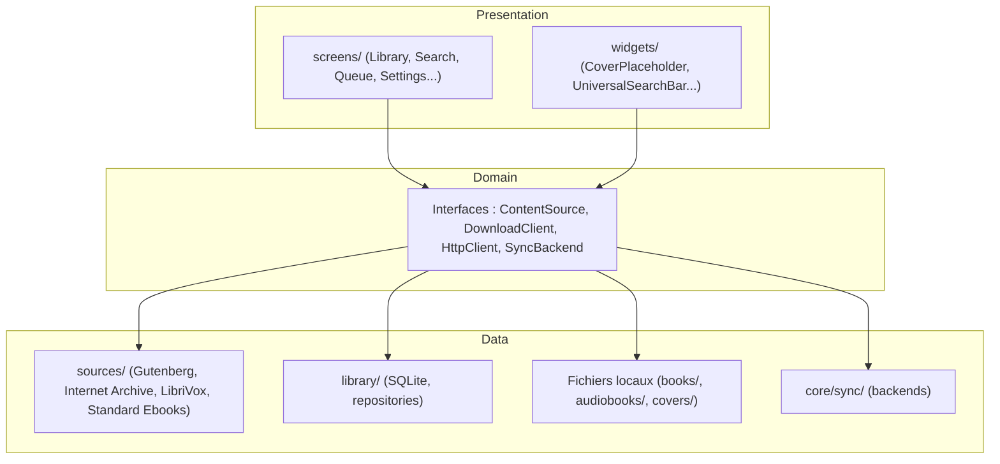

# 00 — Vision et Portée

## Identité

**Libraria est une bibliothèque personnelle numérique pour livres et audiobooks.**

Le hub de téléchargement est au service de la bibliothèque. Pas l'inverse.

| Ce qu'est Libraria | Ce que Libraria n'est PAS en V1 |
|---|---|
| Une bibliothèque personnelle (livres + audiobooks) | Un client Prowlarr/torrent |
| Un hub de téléchargement depuis sources libres | Un client Jellyfin/Navidrome |
| Un lecteur EPUB et audiobook intégré | Un lecteur vidéo |
| Une interface extensible vers d'autres médias (V3+) | Un agrégateur de streaming |

## Philosophie : la bibliothèque d'abord

Quand l'utilisateur ouvre Libraria, il voit **sa collection**, pas un écran de recherche vide. Kindle ouvre sur la bibliothèque. Audible ouvre sur la bibliothèque. C'est la bibliothèque qui crée l'attachement à long terme. Recherche et téléchargement sont des fonctions qui **alimentent** la bibliothèque, jamais l'inverse.

```
Bibliothèque  ←  écran d'accueil, point d'entrée permanent
├── Recherche          ← trouver de nouveaux livres/audiobooks
├── Téléchargements    ← suivre la queue en cours
├── Lecture            ← EPUB reader / audiobook player
└── Paramètres         ← sources, thème, infos, sync, clés API
```

## Portée par version (table de référence unique)

| Fonctionnalité | V1 | V2 | V3 | V4+ |
|---|---|---|---|---|
| Bibliothèque livres + audiobooks | ✅ | ✅ | ✅ | ✅ |
| Sources directes (Gutenberg, Internet Archive, LibriVox, Standard Ebooks) | ✅ | ✅ | ✅ | ✅ |
| Téléchargement HTTP direct + queue (concurrence limitée, reprise) | ✅ | ✅ | ✅ | ✅ |
| Lecteur EPUB (thèmes, sauvegarde position exacte, signets) | ✅ | ✅ | ✅ | ✅ |
| Lecteur audiobook (arrière-plan, chapitres, multi-fichiers, vitesse) | ✅ | ✅ | ✅ | ✅ |
| Sécurité réseau/fichiers (URL, zip-bomb, logs, build durci) | ✅ | ✅ | ✅ | ✅ |
| Compression couvertures + cache LRU disque | ✅ | ✅ | ✅ | ✅ |
| Détection fichiers manquants + relier le fichier | ✅ | ✅ | ✅ | ✅ |
| Garde-fou suppression (corbeille 30j) | ✅ | ✅ | ✅ | ✅ |
| OPDS entrant (Calibre-web, Komga, COPS) | ❌ | ✅ | ✅ | ✅ |
| OPDS sortant (Libraria comme serveur local) | ❌ | ✅ | ✅ | ✅ |
| Prowlarr + clients de téléchargement | ❌ | ✅ | ✅ | ✅ |
| Métadonnées enrichies (OpenLibrary, TMDb, AniList, MusicBrainz) | ❌ | ✅ | ✅ | ✅ |
| Étagères + tags libres | ❌ | ✅ | ✅ | ✅ |
| Notes/surlignages exportables + recherche plein texte | ❌ | ✅ | ✅ | ✅ |
| Sauvegarde WebDAV chiffrée incrémentale | ❌ | ✅ | ✅ | ✅ |
| Rapport de diagnostic exportable (zéro télémétrie auto) | ❌ | ✅ | ✅ | ✅ |
| Statistiques de lecture locales | ❌ | ❌ | ✅ | ✅ |
| Recommandations locales (Jaccard, zéro réseau) | ❌ | ❌ | ✅ | ✅ |
| Bibliothèque multimédia (films/séries/anime/musique — métadonnées) | ❌ | ❌ | ✅ | ✅ |
| Synchronisation multi-appareils | ❌ | ❌ | ✅ | ✅ |
| Accessibilité complète (TalkBack, Narrator, WCAG 2.2) | ❌ | ❌ | ✅ | ✅ |
| Clients Jellyfin/Navidrome | ❌ | ❌ | bonus | bonus |
| Profils famille avec PIN | ❌ | ❌ | ❌ | sous réserve |
| Lecture audio synchronisée EPUB↔audiobook | ❌ | ❌ | ❌ | sous réserve |
| Widget Android « Continuer la lecture » | ❌ | ❌ | ❌ | bonus |

## Hors périmètre — Play Store Edition

**Anna's Archive**, **Z-Library**, **Library Genesis** et **Sci-Hub** sont exclus du build publié sur le Play Store, via flag de compilation (voir ADR-014). Ils restent disponibles dans la **GitHub Edition**, désactivés par défaut, activables par toggle utilisateur, sous la responsabilité de la personne qui compile ou installe cette édition. L'ancien ADR-002 (exclusion totale) est *superseded* par ADR-014.

## D'où vient ce document

Cette doc remplace l'empilement précédent (`plan_v6.md`, `guide_v6.md`, leurs addendums Lovable/Copilot/Claude, l'audit en 14 chapitres, et les ajouts divergents faits séparément par Lovable). Chaque sujet a maintenant **une seule référence**, listée dans le `README.md` du dossier `/docs`. Le `GUIDE_PAS_A_PAS.md` (hors de ce dossier) reste le complément pratique « comment coder, dans l'ordre ».

---

# 01 — Décisions architecturales (ADR)

> Format court : Contexte → Décision → Conséquences. Une décision déjà prise ne se rediscute pas sans rouvrir explicitement son ADR.

## ADR-001 — Flutter plutôt que Qt6

**Contexte** : cible Android + Windows natifs, un seul développeur, besoin d'un lecteur EPUB et d'un lecteur audio en arrière-plan.
**Décision** : Flutter. `epub_view` pour l'EPUB, `just_audio`+`audio_service` pour l'audio background, `dio`/`sqflite` pour réseau/stockage, hot reload pour itérer vite.
**Conséquences** : dépendance à la maturité de `epub_view` sur des EPUB complexes (mitigé par un fallback « Ouvrir avec… »). Validation faite : EPUB chargé avec succès en moins de 2h sur un mini-projet test.

## ADR-002 — Anna's Archive exclu définitivement (SUPERSEDED par ADR-014)

**Statut** : *superseded* le 2026-07-02 par ADR-014.

**Décision d'origine** : exclusion totale d'Anna's Archive du dépôt, aucun toggle, aucune configuration ne le réactive. Toute PR fermée sans revue.

**Pourquoi la décision a changé** : le projet passe à deux artefacts Android distincts (Play Store Edition / GitHub Edition — voir ADR-014). L'argument « toggle inutile car le code reste dans le binaire » cesse de tenir dès lors qu'un flag de compilation retire *physiquement* les sources concernées du binaire distribué sur le Play Store. La Play Store Edition conserve exactement la posture d'ADR-002 (sources absentes du binaire). La GitHub Edition introduit un second niveau — toggle utilisateur OFF par défaut — pour les personnes qui compilent ou installent cette édition en connaissance de cause.

**Historique conservé** : cet ADR reste dans le document pour documenter que la question a été tranchée deux fois, avec un contexte différent.

## ADR-003 — 4 sources de contenu en V1, pas plus

**Décision** : Project Gutenberg (Gutendex), Internet Archive, LibriVox, Standard Ebooks. Toutes sans clé API, sans scraping, stables depuis des années.
**Rejeté pour V1** : Wikisource et Open Library comme sources de *contenu* — Open Library reste un enrichisseur de métadonnées en V2, pas un fournisseur de fichiers.

## ADR-004 — Standard Ebooks : fallback JSON → OPDS, pas OPDS seul

**Contexte** : l'endpoint JSON (`ebooks.json`) n'est pas documenté officiellement et peut disparaître sans préavis.
**Décision** : JSON en premier choix (rapide, pas de parsing XML), OPDS en secours si le JSON échoue.
**Conséquences** : le parsing XML du fallback OPDS reste un stub en V1 (liste vide + log), à implémenter en V2 si le JSON venait effectivement à disparaître.

## ADR-005 — `ContentSource` : signature pagination-aware comme référence unique

**Contexte** : deux signatures incompatibles ont existé en parallèle dans l'ancien guide (V1 simple, V2 avec pagination).
**Décision** : on retient la signature pagination-aware (`search(query, {page, limit}) → SourceSearchResult`, `id`/`displayName`) comme la seule version valable, dès le premier connecteur écrit. Détail complet dans `06_SOURCES_CONNECTEURS.md`.
**Conséquences** : les 4 connecteurs V1 s'écrivent directement contre cette signature — pas de migration à faire plus tard.

## ADR-006 — Pas de télémétrie automatique

**Décision** : aucune collecte de données envoyée automatiquement, aucun SDK tiers (Sentry, Crashlytics). Seule option : un rapport de diagnostic exportable, déclenché manuellement par l'utilisateur, qu'il partage où il veut.
**Raisonnement** : cohérent avec ADR-002 (refus de compromis sur la vie privée) et avec le choix de statistiques de lecture 100 % locales.

## ADR-007 — `epub_view` (rendu natif) plutôt que `flutter_epub_viewer` (WebView) — sauf si les CFI s'avèrent indispensables

**Contexte** : les surlignages/notes ont besoin d'une position précise dans le texte (CFI). `epub_view` n'expose pas nativement de sélection avec CFI ; `flutter_epub_viewer` (WebView + epub.js) le fait, mais introduit un moteur JavaScript qui exécute le contenu de l'EPUB.
**Décision** : rester sur `epub_view` par défaut (aucun moteur JS, surface d'attaque plus restreinte). Si la précision CFI s'avère nécessaire en pratique pour les notes (V2, voir `05_DOWNLOAD... non, 07_READER_AUDIOBOOK.md`), bascule vers `flutter_epub_viewer` avec JS du contenu explicitement désactivé/restreint.
**Statut** : décision par défaut prise, bascule conditionnelle non encore tranchée — à statuer avant de coder l'étape notes/surlignages.

## ADR-014 — Deux éditions Android (Play Store / GitHub) via flag de compilation

**Contexte** : la boutique Google Play interdit toute app qui « facilite l'accès à des contenus enfreignant le droit d'auteur ». Historiquement (ADR-002) le projet excluait donc totalement Anna's Archive et consorts, jusque dans le dépôt public. L'inconvénient : les utilisateurs qui veulent ces connecteurs — usage privé, juridictions différentes, catalogues d'archives — n'ont rien.

**Décision** : produire **deux artefacts Android distincts** à partir du même dépôt.

| Édition | Cible | Flag de build | Sources livrées | Toggle utilisateur |
|---|---|---|---|---|
| **Play Store Edition** | Google Play | *défaut* (`EXTENDED_SOURCES=false`) | 4 sources V1 uniquement | — |
| **GitHub Edition** | Releases GitHub | `--dart-define=EXTENDED_SOURCES=true` | V1 + Anna's Archive, Z-Library, Libgen, Sci-Hub | OFF par défaut, activable un par un |
| **Windows** | Releases GitHub | idem GitHub Edition (`--dart-define=EXTENDED_SOURCES=true`) | idem GitHub Edition | idem |

**Deux verrous, pas un** :

1. **Compile-time** : `const bool.fromEnvironment('EXTENDED_SOURCES')` — évalué à la compilation. Avec `false`, le tree-shaker Dart retire les classes `AnnasArchiveSource`, `ZLibrarySource`, `LibgenSource`, `SciHubSource` du binaire. Il n'y a rien à activer, même en reversant l'APK Play Store.
2. **Runtime** : `ExtendedSourcesSettings` — toggle par source, OFF par défaut *même* en GitHub Edition. Un utilisateur de la GitHub Edition doit consciemment activer chaque source.

**Conséquences** :
- Le dossier `lib/sources/extended/` est présent dans tous les builds — c'est le flag qui rend son contenu atteignable ou non.
- `ExtendedSourcesRegistry.allAvailable` renvoie `[]` sur Play Store : l'écran de recherche et l'écran Paramètres n'ont besoin d'aucun `if` supplémentaire.
- CI : deux jobs `build-android-playstore` et `build-android-github` (voir `.github/workflows/ci.yml`).
- `CONTRIBUTING.md` : toute nouvelle source « à statut variable » passe par `lib/sources/extended/` + entrée dans le registre, jamais dans `lib/sources/<name>/` directement.
- Responsabilité : le README de la GitHub Edition doit rappeler explicitement que l'activation d'une source étendue est un acte utilisateur, hors garantie du projet.

## ADR-008 — Composition unique de `DownloadManager`

**Contexte** : 3 versions partielles et incompatibles de cette classe ont coexisté dans l'ancien guide (concurrence non gérée par l'une, pause non fonctionnelle dans une autre, priorité ignorée dans une troisième).
**Décision** : une seule version canonique, documentée dans `05_DOWNLOAD_MANAGER... ` → en réalité fichier `lib/download_manager/download_manager.dart`, référence unique dans le présent dossier de doc sous le chapitre dédié.
**Conséquences** : toute modification future de cette classe doit être faite *dans* la version canonique, jamais en ajoutant une redéfinition parallèle ailleurs.

## ADR-009 — Convention de dossiers `lib/` unique

**Contexte** : un addendum externe (Lovable, étapes anciennement 74-80) a utilisé `lib/data/` et `lib/ui/`, alors que le reste du projet utilise `lib/core/`, `lib/library/`, `lib/screens/`, `lib/sources/`, `lib/readers/`, `lib/download_manager/`.
**Décision** : convention unique = celle du plan d'origine (`lib/core/`, `lib/library/`, `lib/screens/`, `lib/sources/`, `lib/readers/`, `lib/download_manager/`, `lib/theme/`, `lib/widgets/`, `lib/server/`, `lib/export/`, `lib/stats/`, `lib/recommendations/`). Tout code reçu d'un outil externe est renommé pour s'y conformer avant intégration.

## ADR-010 — Compression des couvertures à l'enregistrement, pas après coup

**Décision** : redimensionner (400×600 max) et ré-encoder en JPEG q85 au moment de l'écriture sur disque (`CoverProcessor`), pas en tâche de fond différée. Une migration one-shot recompresse les couvertures déjà existantes au premier lancement après mise à jour.

## ADR-011 — Suppression : corbeille à 2 paliers, pas de suppression instantanée en masse

**Décision** : suppression simple (< 10 items) = confirmation classique. Suppression batch (10-50 items) = saisie du mot « SUPPRIMER ». Au-delà de 50 = compte à rebours 5s + double confirmation. Toute suppression passe par une corbeille soft (`deleted_at`), purge réelle après 30 jours.

## ADR-012 — Pas de profils famille en V1-V3

**Contexte** : proposé comme feature V2+, mais impliquerait l'isolation complète des bibliothèques par profil, pas juste un PIN.
**Décision** : reporté sous réserve de validation d'un besoin réel d'usage partagé (V4+). Disproportionné par rapport à la philosophie « bibliothèque personnelle d'un seul utilisateur » (voir `00_VISION_ET_PORTEE.md`).

## ADR-013 — Lecture audio synchronisée EPUB↔audiobook : version dégradée seulement

**Contexte** : aucun identifiant commun entre une édition texte et un enregistrement audio du domaine public ; les découpages de chapitres diffèrent presque toujours entre éditions.
**Décision** : si développée (V4+), liaison manuelle confirmée par l'utilisateur, synchronisation au niveau du chapitre seulement (pas de la position exacte), annoncée comme « approximative » dans l'UI.

---

# 02 — Architecture

## Vue en couches



**Honnêteté sur le terme « Clean Architecture »** : la structure réelle est une séparation par fonctionnalité (feature folders) avec une couche d'interfaces partagée, pas une séparation stricte domain/data/presentation avec des classes `UseCase` dédiées. C'est un choix pragmatique raisonnable pour un projet solo — mais il faut arrêter de l'appeler « Clean Architecture 9.5/10 » comme l'a fait un audit précédent : ce n'est pas ce pattern, et ce n'est pas grave que ça ne le soit pas.

## Structure des modules (référence unique)

```
lib/
├── core/
│   ├── models/          MediaType, SearchResult, DownloadJob, LibraryItem, Bookmark, SearchQuery
│   ├── http/             HttpClient (interface), DioHttpClient
│   ├── logging/          AppLogger, LogSanitizer, LogRotator
│   ├── errors/           LibrariaException + sous-classes (voir ce chapitre, §Exceptions)
│   ├── security/         UrlValidator, CertificateValidator, FilenameSanitizer,
│   │                     ZipBombGuard, WindowsPathValidator
│   ├── network/          RateLimiter, CircuitBreaker
│   ├── integrity/        ChecksumVerifier
│   ├── cache/            SearchCache, CacheVersionManager, CoverCacheManager
│   ├── diagnostics/      DiagnosticReportService
│   ├── connectivity/     ConnectivityService
│   ├── metadata/         MetadataProvider, OpenLibraryEnricher, TmdbProvider, AniListProvider...
│   └── sync/             SyncBackend, SettingsSyncService, ProgressSyncService
├── sources/
│   ├── content_source.dart      Interface ContentSource (voir 06_SOURCES_CONNECTEURS.md)
│   ├── base_content_source.dart Classe de base avec rate limiter/circuit breaker/validation intégrés
│   ├── gutenberg/ · internet_archive/ · librivox/ · standard_ebooks/
│   ├── opds/ · prowlarr/        V2
├── download_clients/      V2 : qbittorrent/, transmission/, sabnzbd/
├── download_manager/       download_manager.dart — référence UNIQUE, voir 05_DOWNLOAD_MANAGER.md
├── library/
│   ├── library_repository.dart, shelf_repository.dart, note_repository.dart, tag_repository.dart
│   ├── database_helper.dart      onConfigure (PRAGMA), onCreate, onUpgrade séquentiel
│   ├── import_service.dart
│   ├── local_file_verifier.dart
│   └── migrations/                migration_v1.dart … migration_v12.dart (voir 04_BASE_DE_DONNEES.md)
├── readers/                epub_reader_screen.dart, audio_player_screen.dart
├── server/                 opds_server.dart (OPDS sortant, V2)
├── export/                 library_exporter.dart
├── stats/                  reading_stats_service.dart
├── recommendations/        local_recommender.dart
├── screens/                library_screen.dart (accueil), search_screen.dart, queue_screen.dart,
│                           settings_screen.dart, media_detail_screen.dart, ...
├── widgets/                cover_placeholder.dart, universal_search_bar.dart
├── theme/                  app_colors.dart, app_theme.dart, reader_themes.dart
└── main.dart                composition root (voir ce chapitre, §Composition root)
```

## Hiérarchie d'exceptions (référence unique)

```dart
// lib/core/errors/exceptions.dart
abstract class LibrariaException implements Exception {
  final String technical;
  final String userMessage;
  LibrariaException(this.technical, this.userMessage);
}

class NetworkException extends LibrariaException {
  NetworkException(super.technical, super.userMessage);
}
class SourceException extends LibrariaException {
  SourceException(super.technical, super.userMessage);
}
class DiskFullException extends LibrariaException {
  DiskFullException(super.technical, super.userMessage);
}
class ParsingException extends LibrariaException {
  ParsingException(super.technical, super.userMessage);
}
class CorruptedFileException extends LibrariaException {
  CorruptedFileException(super.technical, super.userMessage);
}
```

`CorruptedFileException` était utilisée par `ChecksumVerifier`/`ZipBombGuard` dans une version antérieure du guide sans jamais avoir été déclarée — corrigé ici, une fois pour toutes.

## Composition root

Avec ~15 services indépendants, le câblage se fait en un seul endroit, jamais dispersé :

```dart
// lib/main.dart
void main() async {
  WidgetsFlutterBinding.ensureInitialized();

  final db = await DatabaseHelper.database; // onConfigure (PRAGMA) + migrations appliquées ici

  final results = await Future.wait([
    PermissionService.requestStoragePermissions(),
    PermissionService.requestNotificationPermission(),
  ]);

  final httpClient = DioHttpClient();
  final libraryRepo = LibraryRepository(db);
  final downloadManager = DownloadManager(httpClient: httpClient, repository: libraryRepo, db: db);
  await downloadManager.resumeAll();

  runApp(MultiProvider(
    providers: [
      Provider<HttpClient>.value(value: httpClient),
      ChangeNotifierProvider.value(value: downloadManager),
      ChangeNotifierProvider(create: (_) => ConnectivityService()),
      Provider(create: (_) => libraryRepo),
      Provider(create: (_) => ShelfRepository(db)),
      Provider(create: (_) => NoteRepository(db)),
      Provider(create: (_) => TagRepository(db)),
      Provider(create: (_) => ReadingStatsService(db)),
      Provider(create: (_) => LocalRecommender()),
      Provider(create: (_) => DiagnosticReportService()),
      Provider(create: (_) => CoverCacheManager(db, coversDir)),
      // 4 sources V1, chacune via BaseContentSource (rate limiter + circuit breaker inclus)
      Provider<ContentSource>(create: (_) => GutenbergSource()),
      Provider<ContentSource>(create: (_) => InternetArchiveSource()),
      Provider<ContentSource>(create: (_) => LibrivoxSource()),
      Provider<ContentSource>(create: (_) => StandardEbooksSource()),
    ],
    child: const LibrariaApp(),
  ));
}
```

C'est le point d'assemblage qui n'existait dans aucune étape de l'ancien guide — chaque brique était montrée isolément.

## Navigation — library-first

```dart
const destinations = [
  NavigationDestination(icon: Icon(Icons.auto_stories), label: 'Bibliothèque'),
  NavigationDestination(icon: Icon(Icons.search),       label: 'Recherche'),
  NavigationDestination(icon: Icon(Icons.download),     label: 'Téléchargements'),
  NavigationDestination(icon: Icon(Icons.settings),     label: 'Paramètres'),
];
// _index commence toujours à 0 → LibraryScreen est l'accueil
```

## `MediaType` — défini complet dès V1, activé progressivement

```dart
enum MediaType { book, audiobook, movie, series, anime, music }
```

V1 filtre l'UI sur `book`/`audiobook` uniquement ; le champ `media_type TEXT` accepte toutes les valeurs dès la première migration — activer les autres types en V3 ne touche pas au schéma.

---

# 03 — Sécurité (référence unique)

## Principe général

Chaque connecteur (`BaseContentSource`, voir `06_SOURCES_CONNECTEURS.md`) passe automatiquement par validation d'URL, rate limiting et circuit breaker — un nouveau connecteur ne peut pas les oublier puisqu'il en hérite plutôt que d'implémenter `ContentSource` directement.

## Validation des URL et des certificats

```dart
// lib/core/security/url_validator.dart
class UrlValidator {
  static const _allowedSchemes = {'http', 'https'};
  static const _blockedHosts = {'localhost', '127.0.0.1', '0.0.0.0', '::1'};

  static Uri validate(String url, {bool allowPrivateNetwork = false}) {
    final uri = Uri.tryParse(url);
    if (uri == null) throw NetworkException('Invalid URL', 'URL invalide');
    if (!_allowedSchemes.contains(uri.scheme)) {
      throw NetworkException('Forbidden scheme: ${uri.scheme}', 'Schéma non autorisé');
    }
    if (!allowPrivateNetwork && (_blockedHosts.contains(uri.host) || isPrivateIp(uri.host))) {
      throw NetworkException('Forbidden host: ${uri.host}', 'Hôte non autorisé pour cette source');
    }
    return uri;
  }

  static bool isPrivateIp(String host) {
    final parts = host.split('.').map(int.tryParse).toList();
    if (parts.length != 4 || parts.any((p) => p == null)) return false;
    final a = parts[0]!, b = parts[1]!;
    return a == 10 || (a == 172 && b >= 16 && b <= 31) || (a == 192 && b == 168);
  }
}
```

`allowPrivateNetwork: true` réservé aux connecteurs LAN explicites (OPDS local, Prowlarr) — jamais aux 4 sources publiques V1.

**Revalidation sur redirection** — Dio suit les redirections HTTP par défaut ; sans revalidation, un serveur compromis pourrait rediriger vers une IP privée après une validation initiale passée (SSRF). Les redirections sont gérées manuellement, avec revalidation à chaque hop :

```dart
// lib/core/http/dio_http_client.dart
final _dio = Dio(BaseOptions(followRedirects: false));

Future<Response> getWithSafeRedirects(String url, {int maxHops = 3}) async {
  var currentUrl = url;
  for (var hop = 0; hop <= maxHops; hop++) {
    UrlValidator.validate(currentUrl); // revalidé à CHAQUE hop
    final response = await _dio.get(currentUrl,
        options: Options(followRedirects: false, validateStatus: (s) => s != null && s < 400));
    final loc = response.headers.value('location');
    if ((response.statusCode == 301 || response.statusCode == 302 || response.statusCode == 307) && loc != null) {
      currentUrl = loc;
      continue;
    }
    return response;
  }
  throw NetworkException('Too many redirects', 'Trop de redirections');
}
```

```dart
// lib/core/security/certificate_validator.dart
class CertificateValidator {
  static bool shouldAllowSelfSigned({required Uri uri, required bool userOptIn}) {
    if (!userOptIn) return false;
    if (uri.host == 'localhost' || uri.host.endsWith('.local')) return true;
    if (UrlValidator.isPrivateIp(uri.host)) return true;
    return false; // Internet public : jamais
  }
}
```

## Anti path-traversal

```dart
// lib/core/security/filename_sanitizer.dart
class FilenameSanitizer {
  static final _forbidden = RegExp(r'[<>:"/\\|?*\x00-\x1f]');
  static const _maxLen = 100;
  static final _reservedWindows = {
    'CON','PRN','AUX','NUL','COM1','COM2','COM3','COM4','COM5','COM6','COM7','COM8','COM9',
    'LPT1','LPT2','LPT3','LPT4','LPT5','LPT6','LPT7','LPT8','LPT9',
  };

  static String sanitize(String name) {
    var s = name.replaceAll(_forbidden, '_').replaceAll('..', '_').trim();
    if (s.isEmpty) s = 'file_${DateTime.now().millisecondsSinceEpoch}';
    final upper = s.toUpperCase().split('.').first;
    if (_reservedWindows.contains(upper)) s = '_$s';
    if (s.length > _maxLen) s = s.substring(0, _maxLen);
    return s;
  }

  /// Dernière ligne de défense : le chemin final doit résoudre dans le dossier attendu.
  static bool isWithinSandbox(String filePath, String sandboxDir) {
    final resolved = p.normalize(File(filePath).absolute.path);
    final sandbox  = p.normalize(Directory(sandboxDir).absolute.path);
    return p.isWithin(sandbox, resolved) || resolved == sandbox;
  }
}
```

**Spécificités Windows** (longueur de chemin, noms réservés, caractères supplémentaires) :

```dart
// lib/core/security/windows_path_validator.dart
class WindowsPathValidator {
  static const int legacyMax = 260;
  static const int longPathMax = 32767;

  static String? validate(String path, {bool longPathSupport = false}) {
    if (path.isEmpty) return 'path.empty';
    if (path.length > (longPathSupport ? longPathMax : legacyMax)) return 'path.too_long';
    for (final seg in path.split(RegExp(r'[\\/]+'))) {
      if (seg.isEmpty) continue;
      if (seg.endsWith(' ') || seg.endsWith('.')) return 'path.trailing_dot_or_space';
    }
    return null; // FilenameSanitizer gère déjà les caractères interdits et noms réservés
  }
}
```

## Anti zip-bomb et vérification de type EPUB

```dart
// lib/core/security/zip_bomb_guard.dart
class ZipBombGuard {
  static const _maxRatio = 200;
  static const _maxUncompressedBytes = 200 * 1024 * 1024;

  /// Décompression et hachage en flux (compute() + openRead()), JAMAIS readAsBytes()
  /// sur un fichier qui peut dépasser quelques Mo — un audiobook de 800 Mo chargé
  /// entier en RAM sur le thread principal est un risque réel d'OOM et de gel UI.
  static Future<void> check(String filePath) => compute(_checkInIsolate, filePath);

  static Future<void> _checkInIsolate(String filePath) async {
    final file = File(filePath);
    final compressed = await file.length();
    final inputStream = InputFileStream(filePath);
    final archive = ZipDecoder().decodeStream(inputStream); // décodage en flux, pas decodeBytes()

    var uncompressed = 0;
    var mimetypeFound = false;
    for (final entry in archive) {
      uncompressed += entry.size;
      if (uncompressed > _maxUncompressedBytes) {
        throw CorruptedFileException('ZIP bomb suspected', 'Fichier EPUB corrompu ou suspect');
      }
      if (entry.name == 'mimetype') mimetypeFound = true;
    }
    if (compressed > 0 && uncompressed / compressed > _maxRatio) {
      throw CorruptedFileException('ZIP bomb ratio', 'Fichier EPUB corrompu ou suspect');
    }
    if (!mimetypeFound) {
      throw CorruptedFileException('Not a valid EPUB', 'Fichier invalide');
    }
  }
}
```

Appelé après téléchargement (voir `04_BASE_DE_DONNEES.md`/`DownloadManager`) et de nouveau avant ouverture d'un import local.

## Vérification d'intégrité par hash (Internet Archive)

```dart
// lib/core/integrity/checksum_verifier.dart
class ChecksumVerifier {
  /// Hachage en flux chunké — jamais le fichier entier en mémoire.
  static Future<bool> verify(String filePath, {String? expectedSha1, String? expectedMd5}) {
    if (expectedSha1 == null && expectedMd5 == null) return Future.value(true);
    return compute(_verifyInIsolate, {'path': filePath, 'sha1': expectedSha1, 'md5': expectedMd5});
  }

  static Future<bool> _verifyInIsolate(Map<String, String?> args) async {
    final file = File(args['path']!);
    final sha1Output = AccumulatorSink<Digest>();
    final sha1Sink = sha1.startChunkedConversion(sha1Output);
    await for (final chunk in file.openRead()) {
      sha1Sink.add(chunk);
    }
    sha1Sink.close();
    final actual = sha1Output.events.single.toString();
    if (args['sha1'] != null && actual.toLowerCase() != args['sha1']!.toLowerCase()) return false;
    return true; // idem pour md5 si fourni
  }
}
```

Seule Internet Archive expose des hash MD5/SHA-1 par fichier via son API `/metadata/{id}` parmi les 4 sources V1 — Gutendex n'en fournit pas. L'appel à `fetchChecksums()` passe par le rate limiter de sa propre source (héritage `BaseContentSource`), pas seulement `search()`.

## Sanitization des logs

```dart
// lib/core/logging/log_sanitizer.dart
class LogSanitizer {
  static final _patterns = [
    RegExp(r'(api[_-]?key|token|password|secret|passphrase)["\s]*[:=]["\s]*[^&\s"]+', caseSensitive: false),
    RegExp(r'Bearer\s+[A-Za-z0-9._-]+'),
    RegExp(r'Basic\s+[A-Za-z0-9+/=]+'),
    RegExp(r'https?://[^:/]+:[^@/]+@'),
  ];
  static String sanitize(String s) {
    var out = s;
    for (final p in _patterns) { out = out.replaceAll(p, '[REDACTED]'); }
    return out;
  }
}
```

Branché dans `AppLogger` directement (pas seulement à l'export du rapport de diagnostic) — important parce que le rapport de diagnostic (voir `09_TESTS_CI.md`/diagnostics) partage les logs tels quels via `share_plus`.

## Durcissement du build Android

```gradle
android { buildTypes { release { debuggable false } } }
```
```xml
<application android:allowBackup="false" android:extractNativeLibs="false" ...>
```
```bash
flutter build apk --obfuscate --split-debug-info=build/symbols/ --release
```

`build/symbols/` conservé hors du repo Git — nécessaire pour désobfusquer une stack trace de crash dans un rapport de diagnostic.

## Sauvegarde complète chiffrée

Le chiffrement (Argon2id + AES-256-GCM, déjà construit pour la sync des paramètres) est réutilisé pour la sauvegarde complète de la bibliothèque, pas réimplémenté :

```dart
Future<void> backupFullLibraryEncrypted(String passphrase, SyncBackend backend) async {
  final json = await libraryExporter.exportJson();
  final encrypted = await SettingsSyncService.encrypt(json, passphrase);
  await backend.upload('libraria_backup_${DateTime.now().toIso8601String()}.enc', encrypted);
}
```

Les clés API ne sont **jamais** incluses dans cet export par défaut — opt-in explicite requis.

## Stockage des clés (V2+)

Android : `flutter_secure_storage` → Keystore. Windows : `flutter_secure_storage` → Credential Manager (DPAPI). La table `settings` ne stocke jamais de credential en clair — uniquement thème, langue, URLs de serveurs sans identifiants, historique de recherche.

## Points restant ouverts (non bloquants)

- Rate limiting/anti-DoS local sur le serveur OPDS sortant (V2, à coder avec `04_... /opds_server.dart`).
- Revalidation des URL de connecteurs à la restauration d'une sauvegarde.
- `Retry-After` non encore respecté explicitement par le circuit breaker sur réponse 429.

Détail de priorisation : `10_ROADMAP.md`.

---

# 04 — Base de Données (référence unique)

## Configuration de connexion — à ne jamais oublier

```dart
// lib/library/database_helper.dart
static Future<Database> _initDatabase() async {
  final path = join(await getDatabasesPath(), _dbName);
  return openDatabase(
    path,
    version: _dbVersion, // 12 — voir séquence de migrations ci-dessous
    onConfigure: (db) async {
      // SANS CES DEUX LIGNES :
      // - tous les ON DELETE CASCADE du schéma sont silencieusement INACTIFS (comportement
      //   par défaut de SQLite) — supprimer un livre laisse des notes/signets/sessions orphelins.
      // - les écritures concurrentes (position audio toutes les 10s + lecture UI bibliothèque)
      //   se bloquent mutuellement sans nécessité.
      await db.execute('PRAGMA foreign_keys = ON;');
      await db.execute('PRAGMA journal_mode = WAL;');
    },
    onCreate: (db, version) async => db.execute(migrationV1),
    onUpgrade: (db, oldVersion, newVersion) async {
      for (var v = oldVersion + 1; v <= newVersion; v++) {
        final migration = _migrationForVersion(v);
        if (migration == null) continue;
        AppLogger.info('Migration v$v: start', module: 'DB_MIGRATION');
        try {
          for (final stmt in migration.split(';')) {
            final s = stmt.trim();
            if (s.isNotEmpty) await db.execute(s);
          }
          AppLogger.info('Migration v$v: success', module: 'DB_MIGRATION');
        } catch (e, st) {
          AppLogger.error('Migration v$v: failed', module: 'DB_MIGRATION', error: e, stackTrace: st);
          rethrow; // sqflite ne persiste pas la nouvelle version si onUpgrade lève — pas besoin
                   // de db.transaction() imbriqué, onUpgrade s'exécute déjà dans une transaction
                   // implicite (l'imbrication lève "Cannot start a transaction within a transaction").
        }
      }
    },
  );
}
```

## Schéma complet — toutes tables, état final

```sql
-- Bibliothèque
CREATE TABLE IF NOT EXISTS library_items (
  id              TEXT PRIMARY KEY,
  title           TEXT NOT NULL,
  author          TEXT,
  media_type      TEXT NOT NULL,
  local_path      TEXT,
  cover_path      TEXT,
  source_name     TEXT,
  source_url      TEXT,
  added_at        INTEGER NOT NULL,
  last_opened_at  INTEGER,
  read_progress   REAL    DEFAULT 0.0,
  last_cfi        TEXT,             -- v9 : position exacte de reprise (read_progress reste pour la barre %)
  is_favorite     INTEGER DEFAULT 0,
  notes           TEXT,
  year            INTEGER, genre TEXT, rating REAL, duration_s INTEGER,
  description     TEXT, cover_url TEXT, external_id TEXT,
  is_missing      INTEGER NOT NULL DEFAULT 0,   -- v10 : fichier local introuvable
  last_verified_at INTEGER,                      -- v10
  deleted_at      INTEGER,                       -- v10 : corbeille soft, purge à 30 jours
  content_sha256  TEXT                           -- v10 : vérifie un fichier "relié" après déplacement
);
CREATE INDEX IF NOT EXISTS idx_library_items_media_type   ON library_items(media_type);    -- v9
CREATE INDEX IF NOT EXISTS idx_library_items_last_opened  ON library_items(last_opened_at); -- v9
CREATE INDEX IF NOT EXISTS idx_items_missing              ON library_items(is_missing);     -- v10
CREATE INDEX IF NOT EXISTS idx_items_deleted              ON library_items(deleted_at);      -- v10

-- Téléchargements (queue + historique)
CREATE TABLE IF NOT EXISTS downloads (
  id TEXT PRIMARY KEY, library_item_id TEXT, title TEXT NOT NULL, download_url TEXT NOT NULL,
  save_path TEXT, status TEXT NOT NULL, progress REAL DEFAULT 0.0, priority INTEGER DEFAULT 2,
  error_message TEXT, created_at INTEGER NOT NULL, completed_at INTEGER,
  retry_count INTEGER DEFAULT 0, last_retry_at INTEGER,
  FOREIGN KEY (library_item_id) REFERENCES library_items(id)
);
CREATE INDEX IF NOT EXISTS idx_downloads_status ON downloads(status); -- v9

-- Paramètres clé-valeur (jamais de credential en clair — voir 03_SECURITE.md)
CREATE TABLE IF NOT EXISTS settings (key TEXT PRIMARY KEY, value TEXT NOT NULL);

-- Signets/annotations
CREATE TABLE IF NOT EXISTS bookmarks (
  id TEXT PRIMARY KEY, item_id TEXT NOT NULL, location TEXT NOT NULL,
  text TEXT, note TEXT, color INTEGER DEFAULT 0, created_at INTEGER NOT NULL,
  FOREIGN KEY (item_id) REFERENCES library_items(id) ON DELETE CASCADE
);
CREATE INDEX IF NOT EXISTS idx_bookmarks_item ON bookmarks(item_id);

-- Étagères (collections nommées)
CREATE TABLE IF NOT EXISTS shelves (id TEXT PRIMARY KEY, name TEXT NOT NULL, color TEXT, position INTEGER DEFAULT 0);
CREATE TABLE IF NOT EXISTS shelf_items (
  shelf_id TEXT NOT NULL, item_id TEXT NOT NULL, position INTEGER DEFAULT 0,
  PRIMARY KEY (shelf_id, item_id),
  FOREIGN KEY (shelf_id) REFERENCES shelves(id) ON DELETE CASCADE,
  FOREIGN KEY (item_id)  REFERENCES library_items(id) ON DELETE CASCADE
);

-- Tags libres (transverses, complètent les étagères — v11)
CREATE TABLE IF NOT EXISTS tags (
  id INTEGER PRIMARY KEY AUTOINCREMENT, label TEXT NOT NULL UNIQUE COLLATE NOCASE,
  color INTEGER NOT NULL DEFAULT 0, created_at INTEGER NOT NULL
);
CREATE TABLE IF NOT EXISTS item_tags (
  item_id TEXT NOT NULL REFERENCES library_items(id) ON DELETE CASCADE,
  tag_id  INTEGER NOT NULL REFERENCES tags(id) ON DELETE CASCADE,
  PRIMARY KEY (item_id, tag_id)
);
CREATE INDEX IF NOT EXISTS idx_item_tags_tag ON item_tags(tag_id);

-- Notes et surlignages (avec CFI réel — voir 07_READER_AUDIOBOOK.md)
CREATE TABLE IF NOT EXISTS notes (
  id TEXT PRIMARY KEY, item_id TEXT NOT NULL, cfi TEXT NOT NULL,
  color TEXT NOT NULL DEFAULT '#FFEB3B', text TEXT, note TEXT, created_at INTEGER NOT NULL,
  FOREIGN KEY (item_id) REFERENCES library_items(id) ON DELETE CASCADE
);

-- Recherche plein texte dans les notes (v12)
CREATE VIRTUAL TABLE IF NOT EXISTS notes_fts USING fts5(
  body, content='notes', content_rowid='rowid', tokenize='unicode61 remove_diacritics 2'
);
CREATE TRIGGER IF NOT EXISTS notes_ai AFTER INSERT ON notes BEGIN
  INSERT INTO notes_fts(rowid, body) VALUES (new.rowid, new.text);
END;
CREATE TRIGGER IF NOT EXISTS notes_ad AFTER DELETE ON notes BEGIN
  INSERT INTO notes_fts(notes_fts, rowid, body) VALUES('delete', old.rowid, old.text);
END;
CREATE TRIGGER IF NOT EXISTS notes_au AFTER UPDATE ON notes BEGIN
  INSERT INTO notes_fts(notes_fts, rowid, body) VALUES('delete', old.rowid, old.text);
  INSERT INTO notes_fts(rowid, body) VALUES (new.rowid, new.text);
END;

-- Sessions de lecture (statistiques locales, V3)
CREATE TABLE IF NOT EXISTS reading_sessions (
  id TEXT PRIMARY KEY, item_id TEXT NOT NULL, started_at INTEGER NOT NULL,
  ended_at INTEGER, pages_read INTEGER DEFAULT 0,
  FOREIGN KEY (item_id) REFERENCES library_items(id) ON DELETE CASCADE
);

-- Cache des couvertures (LRU, étape cache disque)
CREATE TABLE IF NOT EXISTS cover_cache_index (
  filename TEXT PRIMARY KEY, size_bytes INTEGER NOT NULL, accessed_at INTEGER NOT NULL
);
```

## Séquence de migrations (réconciliée — collision résolue)

| Version | Contenu | Origine |
|---|---|---|
| v1 | Schéma initial (3 tables) | Plan d'origine |
| v2 | `retry_count`, `last_retry_at` | V2 |
| v3 | Champs enrichissement (`year`, `genre`, `rating`...) | V3 |
| v4 | `bookmarks` | V4 |
| v5 | `shelves`, `shelf_items` | Étagères |
| v6 | `reading_sessions` | Statistiques |
| v7 | `notes` | Surlignages |
| v8 | `cover_cache_index` | Cache LRU couvertures |
| v9 | Index (`media_type`, `last_opened_at`, `downloads.status`) + `last_cfi` | Audit — correctifs |
| v10 | `is_missing`, `last_verified_at`, `deleted_at`, `content_sha256` | Fichiers manquants + corbeille |
| v11 | `tags`, `item_tags` | Tags libres |
| v12 | `notes_fts` + triggers | Recherche plein texte notes |

**Note de réconciliation** : un addendum externe (Lovable) avait assigné le numéro « v8 » à la fois aux tables `is_missing`/`deleted_at` ET en collision avec le `cover_cache_index` déjà numéroté v8 par ailleurs. Renumérotés ici en v9-v12 dans un ordre cohérent — c'est précisément le genre de collision que cette restructuration documentaire doit éliminer.

**Suite de la séquence** : `v13`-`v15` sont introduites au chapitre 12 (12.12), au service des 100 nouvelles fonctionnalités — regroupées par lot plutôt qu'une migration par feature, pour ne pas reproduire la fragmentation ci-dessus.

## Recherche locale — `LIKE` aujourd'hui, FTS5 si la bibliothèque grossit

`LibraryScreen` filtre via `WHERE title LIKE ? OR author LIKE ?` — suffisant jusqu'à quelques milliers d'items. Au-delà, même schéma FTS5 que pour les notes :

```sql
-- À introduire seulement quand le besoin se confirme (pas en V1)
CREATE VIRTUAL TABLE library_items_fts USING fts5(
  title, author, content='library_items', content_rowid='rowid'
);
```

## Sync — purge des références mortes

Le payload de sync (`progress` par item) grossit sans limite sur plusieurs années si les entrées dont l'`item_id` n'existe plus localement ne sont jamais purgées :

```dart
Future<Map<String, dynamic>> buildSyncPayload() async {
  final existingIds = await libraryRepo.getAllIds();
  progressEntries.removeWhere((e) => !existingIds.contains(e.itemId));
  return {/* ... */};
}
```

---

# 05 — DownloadManager (référence unique)

> Cette classe a existé en au moins 3 versions incompatibles dans l'ancien guide. Ce qui suit est la **seule** version à utiliser — toute modification future se fait ici, jamais par une redéfinition ailleurs.

## Version consolidée complète

```dart
// lib/download_manager/download_manager.dart
class DownloadManager extends ChangeNotifier {
  final HttpClient httpClient;
  final LibraryRepository repository;
  final Database db;
  final List<DownloadJob> jobs = [];

  int maxConcurrent = 3; // configurable 1–6, Settings
  int _activeCount = 0;
  final Map<String, CancelToken> _cancelTokens = {};

  DownloadManager({required this.httpClient, required this.repository, required this.db});

  /// Insertion triée par priorité (1 = haute) puis FIFO — pas un simple jobs.add().
  Future<void> enqueue(SearchResult result, {int priority = 2}) async {
    final job = DownloadJob(id: const Uuid().v4(), result: result, priority: priority);
    final insertAt = jobs.indexWhere((j) => j.priority > job.priority);
    if (insertAt == -1) jobs.add(job); else jobs.insert(insertAt, job);
    notifyListeners();

    if (!result.isDirectDownload) {
      job.status = DownloadStatus.failed;
      job.errorMessage = 'Client de téléchargement non configuré.';
      notifyListeners();
      return;
    }
    await _checkDiskSpace(job);
    _tryStartNext();
  }

  Future<void> _checkDiskSpace(DownloadJob job) async {
    final stat = await Directory(libraryDir.path).stat();
    if (stat.size /* approximation dispo */ < 100 * 1024 * 1024) {
      job.status = DownloadStatus.failed;
      job.errorMessage = 'Espace disque insuffisant';
      notifyListeners();
    }
  }

  void _tryStartNext() {
    if (_activeCount >= maxConcurrent) return;
    final next = jobs.firstWhereOrNull((j) => j.status == DownloadStatus.queued);
    if (next == null) return;

    _activeCount++;
    next.status = DownloadStatus.downloading;
    notifyListeners();

    final cancelToken = CancelToken();
    _cancelTokens[next.id] = cancelToken;

    _downloadDirect(next, cancelToken).whenComplete(() {
      _activeCount--;
      _cancelTokens.remove(next.id);
      _tryStartNext();
    });
  }

  Future<void> _downloadDirect(DownloadJob job, CancelToken cancelToken) async {
    try {
      UrlValidator.validate(job.result.downloadUrl); // 03_SECURITE.md

      final savePath = _buildSavePath(job.result); // FilenameSanitizer + isWithinSandbox
      await httpClient.downloadWithResume(
        url: job.result.downloadUrl,
        savePath: savePath,
        cancelToken: cancelToken,
        onProgress: (received, total) {
          job.progress = total > 0 ? received / total : 0;
          notifyListeners();
        },
      );

      await ZipBombGuard.check(savePath); // si EPUB — 03_SECURITE.md
      if (job.result.sourceName == 'Internet Archive') {
        final checksums = await (job.result as dynamic).fetchChecksums?.call();
        if (checksums != null) {
          final ok = await ChecksumVerifier.verify(savePath,
              expectedSha1: checksums['sha1'], expectedMd5: checksums['md5']);
          if (!ok) throw CorruptedFileException('Checksum mismatch', 'Fichier corrompu');
        }
      }

      job.status = DownloadStatus.completed;
      job.localPath = savePath;
      job.completedAt = DateTime.now();
      await repository.saveItem(job.toLibraryItem());
    } catch (e) {
      if (CancelToken.isCancel(e as DioException? ?? DioException(requestOptions: RequestOptions()))) {
        return; // pause volontaire — pas un échec, le fichier partiel reste pour reprise
      }
      await _handleFailure(job, e);
    } finally {
      notifyListeners();
    }
  }

  Future<void> _handleFailure(DownloadJob job, Object error) async {
    final retryable = _isRetryable(error);
    job.retryCount++;
    if (retryable && job.retryCount < 3) {
      job.status = DownloadStatus.queued; // retentera, fichier partiel conservé pour le resume
    } else {
      job.status = DownloadStatus.failed;
      job.errorMessage = error.toString();
      await _cleanupPartialFile(job); // pas de retry prévu → nettoyer, pas de fichier orphelin
    }
  }

  /// 404/4xx = erreur définitive, ne sert à rien de retenter. Timeout/5xx = temporaire.
  bool _isRetryable(Object error) {
    if (error is DioException) {
      final code = error.response?.statusCode;
      if (code != null && code >= 400 && code < 500) return false;
      return true;
    }
    return true;
  }

  Future<void> _cleanupPartialFile(DownloadJob job) async {
    if (job.localPath == null) return;
    final file = File(job.localPath!);
    if (await file.exists()) {
      AppLogger.info('Cleaning up partial file for permanently failed job ${job.id}', module: 'DOWNLOAD');
      await file.delete();
    }
  }

  /// Pause RÉELLE : annule le CancelToken du flux Dio en cours. Le fichier partiel
  /// reste sur disque — downloadWithResume() reprendra depuis sa taille réelle.
  void pauseJob(String jobId) {
    _cancelTokens[jobId]?.cancel('Paused by user');
    jobs.firstWhereOrNull((j) => j.id == jobId)?.status = DownloadStatus.paused;
    notifyListeners();
  }

  void resumeJob(String jobId) {
    final job = jobs.firstWhereOrNull((j) => j.id == jobId);
    if (job == null) return;
    job.status = DownloadStatus.queued;
    notifyListeners();
    _tryStartNext();
  }

  void reorderPriority(String jobId, int newPriority) {
    final job = jobs.firstWhereOrNull((j) => j.id == jobId);
    if (job == null) return;
    job.priority = newPriority;
    jobs.sort((a, b) => a.priority.compareTo(b.priority));
    notifyListeners();
  }

  /// Reprise après crash de l'app — recharge les jobs actifs/en attente au démarrage.
  Future<void> resumeAll() async {
    final rows = await db.query('downloads', where: "status IN ('downloading', 'queued')");
    for (final row in rows) {
      final job = DownloadJob.fromMap(row);
      if (job.status == DownloadStatus.downloading) job.status = DownloadStatus.queued;
      jobs.add(job);
    }
    jobs.sort((a, b) => a.priority.compareTo(b.priority));
    notifyListeners();
    for (var i = 0; i < maxConcurrent; i++) { _tryStartNext(); }
  }

  String _buildSavePath(SearchResult result) {
    final name = FilenameSanitizer.sanitize('${result.author ?? "Inconnu"} — ${result.title}');
    final path = p.join(libraryDir.path, _folderFor(result.mediaType), '$name.${_extFor(result)}');
    assert(FilenameSanitizer.isWithinSandbox(path, libraryDir.path));
    return path;
  }
}
```

## Reprise HTTP (`Range`) — `HttpClient.downloadWithResume`

```dart
// lib/core/http/dio_http_client.dart
Future<void> downloadWithResume({
  required String url,
  required String savePath,
  required CancelToken cancelToken,
  void Function(int received, int total)? onProgress,
}) async {
  final file = File(savePath);
  int startByte = await file.exists() ? await file.length() : 0;

  final response = await _dio.get<ResponseBody>(url,
      cancelToken: cancelToken,
      options: Options(
        headers: startByte > 0 ? {'Range': 'bytes=$startByte-'} : null,
        responseType: ResponseType.stream,
      ));

  final serverHonoredRange = response.statusCode == 206;
  if (startByte > 0 && !serverHonoredRange) {
    startByte = 0;
    await file.writeAsBytes([]);
  }

  final raf = await file.open(mode: startByte > 0 ? FileMode.append : FileMode.write);
  final total = int.tryParse(response.headers.value('content-length') ?? '0') ?? 0;
  int received = startByte;

  try {
    await for (final chunk in response.data!.stream) {
      await raf.writeFrom(chunk);
      received += chunk.length;
      onProgress?.call(received, startByte + total);
    }
  } finally {
    await raf.close();
  }
}
```

`cancelToken` est maintenant un paramètre obligatoire — c'est ce qui permet à `pauseJob()` d'avoir un effet réel sur un téléchargement direct en cours, ce qu'aucune version précédente ne faisait.

## Limites volontaires

- Concurrence : 3 par défaut, configurable 1-6.
- Rate limiting/circuit breaker : gérés au niveau de chaque `ContentSource` (`06_SOURCES_CONNECTEURS.md`), pas dans `DownloadManager` lui-même — la responsabilité est séparée : le manager orchestre, la source protège son propre accès réseau.

---

# 06 — Sources et Connecteurs (référence unique)

## `ContentSource` — signature unique, dès le premier connecteur

```dart
// lib/sources/content_source.dart
abstract class ContentSource {
  String get id;
  String get displayName;
  Future<SourceSearchResult> search(String query, {int? page, int? limit});
}

class SourceSearchResult {
  final List<SearchResult> items;
  final int? totalCount;
  final bool hasMore;
  const SourceSearchResult({required this.items, this.totalCount, this.hasMore = false});
}
```

Cette signature (pagination-aware) est la seule retenue — voir ADR-005 (`01_DECISIONS.md`). Les 4 connecteurs V1 s'écrivent directement contre elle.

## `BaseContentSource` — gardes de sécurité automatiques

```dart
// lib/sources/base_content_source.dart
abstract class BaseContentSource implements ContentSource {
  final RateLimiter _rateLimiter = RateLimiter(maxPerWindow: 30, window: const Duration(seconds: 60));
  final CircuitBreaker _circuitBreaker = CircuitBreaker(failureThreshold: 5, openDuration: const Duration(seconds: 60));

  CircuitState get circuitState => _circuitBreaker.state; // exposé pour l'UI (08_UI_UX)

  @override
  Future<SourceSearchResult> search(String query, {int? page, int? limit}) async {
    await _rateLimiter.acquire(id);
    return _circuitBreaker.call(() async {
      final results = await doSearch(query, page: page, limit: limit);
      for (final r in results.items) { UrlValidator.validate(r.downloadUrl); }
      return results;
    });
  }

  /// Implémenté par chaque connecteur concret.
  Future<SourceSearchResult> doSearch(String query, {int? page, int? limit});

  /// À appeler aussi pour tout appel HTTP additionnel (ex: fetchChecksums sur Internet
  /// Archive) — pas seulement search() — pour que le rate limiting couvre tous les appels.
  Future<T> rateLimited<T>(Future<T> Function() action) async {
    await _rateLimiter.acquire(id);
    return action();
  }
}
```

`CONTRIBUTING.md` impose : tout nouveau connecteur étend `BaseContentSource`, jamais `ContentSource` directement.

## `RateLimiter` et `CircuitBreaker`

```dart
// lib/core/network/rate_limiter.dart
class RateLimiter {
  final int maxPerWindow; final Duration window;
  final _calls = <String, Queue<DateTime>>{};
  RateLimiter({this.maxPerWindow = 30, this.window = const Duration(seconds: 60)});

  Future<void> acquire(String sourceId) async {
    final now = DateTime.now();
    final queue = _calls.putIfAbsent(sourceId, () => Queue());
    while (queue.isNotEmpty && now.difference(queue.first) > window) { queue.removeFirst(); }
    if (queue.length >= maxPerWindow) {
      final waitMs = window.inMilliseconds - now.difference(queue.first).inMilliseconds;
      if (waitMs > 0) await Future.delayed(Duration(milliseconds: waitMs));
    }
    queue.add(DateTime.now());
  }
}
```

```dart
// lib/core/network/circuit_breaker.dart
enum CircuitState { closed, open, halfOpen }

class CircuitBreaker {
  CircuitState state = CircuitState.closed;
  int _failures = 0; DateTime? _openedAt;
  final int failureThreshold; final Duration openDuration;
  CircuitBreaker({this.failureThreshold = 5, this.openDuration = const Duration(seconds: 60)});

  Future<T> call<T>(Future<T> Function() action) async {
    if (state == CircuitState.open) {
      if (DateTime.now().difference(_openedAt!) > openDuration) { state = CircuitState.halfOpen; }
      else { throw SourceException('Circuit open', 'Source temporairement indisponible'); }
    }
    try {
      final result = await action();
      _failures = 0; state = CircuitState.closed;
      return result;
    } on DioException catch (e) {
      if (e.response?.statusCode == 429) {
        // Respecte Retry-After plutôt que la durée fixe par défaut
        final retryAfter = e.response?.headers.value('retry-after');
        if (retryAfter != null) {
          _openedAt = DateTime.now();
          state = CircuitState.open;
          rethrow;
        }
      }
      _onFailure();
      rethrow;
    } catch (_) {
      _onFailure();
      rethrow;
    }
  }

  void _onFailure() {
    _failures++;
    if (_failures >= failureThreshold) { state = CircuitState.open; _openedAt = DateTime.now(); }
  }
}
```

## Les 4 connecteurs V1

| Source | Médias | API | Stabilité |
|---|---|---|---|
| Project Gutenberg | Livres | Gutendex REST (JSON) | Très stable, 70 000+ titres |
| Internet Archive | Livres + Audiobooks | `archive.org/advancedsearch` | Stable, domaine public + prêt légal |
| LibriVox | Audiobooks | `librivox.org/api` REST | Stable, bénévole, domaine public |
| Standard Ebooks | Livres haute qualité | JSON non-officiel + fallback OPDS | Stable, voir ADR-004 |

**Correction d'un comptage erroné dans un audit précédent** : Wikisource et Open Library ne sont **pas** des sources de contenu en V1 — Open Library est un enrichisseur de métadonnées en V2 (`OpenLibraryEnricher`), pas un fournisseur de fichiers.

### Internet Archive — vérification de checksum

```dart
// lib/sources/internet_archive/internet_archive_source.dart
class InternetArchiveSource extends BaseContentSource {
  Future<Map<String, String>?> fetchChecksums(String identifier, String filename) {
    return rateLimited(() async { // passe par le rate limiter de SA source, pas un appel "hors radar"
      try {
        final meta = await _httpClient.get('https://archive.org/metadata/$identifier');
        final files = (meta['files'] as List).cast<Map>();
        final match = files.firstWhere((f) => f['name'] == filename, orElse: () => {});
        if (match.isEmpty) return null;
        return {
          if (match['sha1'] != null) 'sha1': match['sha1'] as String,
          if (match['md5']  != null) 'md5':  match['md5']  as String,
        };
      } catch (e) {
        AppLogger.warn('Checksum fetch failed for $identifier', module: 'INTERNET_ARCHIVE', error: e);
        return null; // un échec ne bloque jamais le téléchargement
      }
    });
  }
}
```

### Standard Ebooks — fallback dual

JSON d'abord (rapide), OPDS en secours. Le parsing XML du fallback reste un stub (liste vide + log) en V1 — voir ADR-004.

## Connecteurs V2 (hors périmètre V1)

OPDS générique (Calibre-web, Komga, COPS — entrant), Prowlarr + clients de téléchargement. OPDS **sortant** (Libraria comme serveur) est documenté à part dans `02_ARCHITECTURE.md`/`lib/server/opds_server.dart` — ce n'est pas un `ContentSource`, c'est l'inverse (Libraria expose, ne consomme pas).

---

# 07 — Reader (EPUB + Audiobook)

## Lecteur EPUB

**Décision par défaut** : `epub_view` (rendu natif Flutter, pas de moteur JS) — voir ADR-007. Fallback « Ouvrir avec… » (`url_launcher`) pour les EPUB trop complexes (CSS avancé, scripts, DRM) : ce n'est pas un échec, c'est un filet de sécurité nécessaire.

### Position de lecture — précise, pas seulement un pourcentage

```sql
-- library_items (voir 04_BASE_DE_DONNEES.md)
read_progress REAL DEFAULT 0.0,  -- barre de progression, affichage rapide
last_cfi      TEXT               -- source de vérité pour la reprise EXACTE
```

Un pourcentage seul dérive dès que la taille de police ou le thème change — le même pourcentage ne correspond plus au même paragraphe. `last_cfi` est écrit à chaque changement de page/chapitre :

```dart
onPageChanged: (cfi) async {
  await libraryRepo.updatePosition(item.id, readProgress: currentPercent, lastCfi: cfi);
},
```

### Thèmes de lecture

| Thème | Fond | Texte | Police |
|---|---|---|---|
| Clair | `#FFFFFF` | `#0A0A0A` | Serif (Georgia) ou Sans |
| Sombre | `#0A0A0A` | `#E0E0E0` | idem |
| Liseuse | `#F4ECD8` | `#3B2A1A` | Serif, interligne augmenté |
| AMOLED / Nord / Gruvbox / Catppuccin | V3 | — | — |

### Accessibilité — taille de texte adaptative

```dart
// À écrire réellement ici, pas seulement référencer un principe ailleurs
Text(
  content,
  textScaleFactor: MediaQuery.textScaleFactorOf(context),
)
```

### Si bascule vers `flutter_epub_viewer` (CFI natifs pour les notes)

```dart
EpubViewer(
  initialCfi: item.lastCfi,
  onChaptersLoaded: (chapters) => _chapters = chapters,
  // Désactiver le JS arbitraire du contenu EPUB (EPUB3 peut en embarquer) :
  // si le package ne propose pas ce flag, injecter une CSP stricte avant rendu,
  // ou rester sur epub_view qui n'a par construction aucun moteur JS.
),
```

## Lecteur Audiobook

`just_audio` + `audio_service` — lecture en arrière-plan, contrôles lockscreen, vitesse 0.5×-2×, minuteur de sommeil, retour/avance 30s, sauvegarde position toutes les 10s.

### Lecture continue multi-fichiers (LibriVox)

LibriVox livre souvent un livre en dizaines de MP3 séparés, pas un seul M4B. Sans traitement, ce n'est pas un livre continu :

```dart
Future<void> _loadAudiobook(LibraryItem item) async {
  final dir = Directory(item.localPath!);
  if (await dir.exists()) {
    final files = (await dir.list().toList())
        .whereType<File>().where((f) => f.path.endsWith('.mp3')).toList()
      ..sort((a, b) => a.path.compareTo(b.path)); // ordre alphabétique = ordre des chapitres

    final source = ConcatenatingAudioSource(
      children: files.map((f) => AudioSource.uri(Uri.file(f.path))).toList(),
    );
    await _player.setAudioSource(source);
  } else {
    await _player.setAudioSource(AudioSource.uri(Uri.file(item.localPath!))); // M4B unique
  }
}
```

**Position stockée** : `(index du fichier dans la liste, position en ms dans ce fichier)`, pas une seule valeur en secondes — sinon la reprise pointe vers le mauvais chapitre après fermeture/réouverture.

### Permissions Android 13-15

```xml
<uses-permission android:name="android.permission.READ_MEDIA_AUDIO" />
<uses-permission android:name="android.permission.READ_MEDIA_IMAGES" />
<uses-permission android:name="android.permission.READ_MEDIA_VISUAL_USER_SELECTED" /> <!-- 14+ -->
<uses-permission android:name="android.permission.FOREGROUND_SERVICE_MEDIA_PLAYBACK" />
<uses-permission android:name="android.permission.FOREGROUND_SERVICE_DATA_SYNC" /> <!-- 15+, téléchargement ET sync -->
```

## Notes et surlignages (V2)

CFI réel (`notes.cfi`), 4 couleurs, export Markdown vers Obsidian/Logseq, recherche plein texte FTS5 (voir `04_BASE_DE_DONNEES.md`) :

```dart
Future<List<NoteHit>> searchNotes(String query, {int limit = 50}) async {
  final rows = await db.rawQuery('''
    SELECT n.id, n.item_id, snippet(notes_fts, 0, '<mark>', '</mark>', '…', 12) AS snippet,
           bm25(notes_fts) AS rank
    FROM notes_fts JOIN notes n ON n.rowid = notes_fts.rowid
    WHERE notes_fts MATCH ? ORDER BY rank LIMIT ?
  ''', [_escapeFts(query), limit]);
  return rows.map(NoteHit.fromRow).toList();
}
```

---

# 08 — UI/UX et Design System

## Palette réelle (référence unique — un audit antérieur en a inventé une autre par erreur)

```dart
class AppColors {
  static const accent = Color(0xFFD71921);            // rouge dot-matrix — boutons, badges, icônes
  static const accentTextOnDark = Color(0xFFFF4D4D);  // texte/erreur SUR FOND SOMBRE uniquement
  static const lightBg = Color(0xFFFAFAFA);
  static const darkBg  = Color(0xFF0A0A0A);
}
```

**Contraste vérifié** (calcul réel, pas approximé) :

| Paire | Ratio | WCAG AA texte normal (seuil 4.5:1) |
|---|---|---|
| `#D71921` sur `#FAFAFA` | ≈ 5,0:1 | ✅ Passe |
| `#D71921` sur `#0A0A0A` | ≈ 3,8:1 | ❌ Ne passe pas (passe pour UI/texte large, seuil 3:1) |

Règle d'usage : `accent` pour tout élément non-textuel sur les deux thèmes ; `accentTextOnDark` uniquement pour du texte sur fond sombre.

## Polices

| Usage | Police |
|---|---|
| Titres, AppBar, badges | Silkscreen (Google Fonts) |
| Corps de texte | JetBrains Mono (Google Fonts) |
| Éléments numériques | DSEG7Classic (optionnel) |

⚠️ Ne jamais utiliser NType82 de Nothing — police propriétaire.

## Composants signature

- Loader : grille de points animée, opacité oscillante
- Barre de progression : rectangles pleins/vides façon dot-matrix
- Badge OFFLINE : fond orange, texte blanc, `BorderRadius.circular(12)`
- Cards bibliothèque : titre Silkscreen, auteur JetBrains Mono, bordure fine

## `CoverPlaceholder` — typographique + icône de type de média

```dart
class CoverPlaceholder extends StatelessWidget {
  final String title; final String? author; final MediaType mediaType;
  // ... initiale + couleur dérivée du hash du titre (voir code complet, 02_ARCHITECTURE.md ne le répète pas)
  // + icône discrète (menu_book / headphones) en coin — distingue livres et audiobooks
  // dans une grille mixte, sans perdre le rendu typographique.
}
```

Compression à l'enregistrement (`CoverProcessor`, 400×600 max, JPEG q85) + cache LRU disque (200 Mo/30j) — détail technique non répété ici, voir `04_BASE_DE_DONNEES.md` pour le schéma `cover_cache_index`.

## États vides — distinguer les causes

Depuis l'introduction du circuit breaker par source, une recherche vide peut signifier deux choses différentes :

```dart
Widget _buildEmptyState() {
  final degraded = sources.where((s) => s.circuitState == CircuitState.open).toList();
  if (degraded.isNotEmpty) {
    return Column(children: [
      Text('${degraded.length} source(s) temporairement indisponible(s) : ${degraded.map((s) => s.displayName).join(", ")}'),
      TextButton(onPressed: runSearch, child: const Text('Réessayer')),
    ]);
  }
  return const Text('Aucun résultat pour cette recherche.');
}
```

## Accessibilité (WCAG 2.2)

- Labels sur boutons icône-only (`Semantics`/`tooltip`).
- Texte alternatif sur couvertures (`Semantics(label:, image:)`).
- Taille de texte dynamique (`MediaQuery.textScaleFactorOf`, voir `07_READER_AUDIOBOOK.md`).
- **SC 2.5.7 « Dragging Movements »** : le réordonnancement des étagères par glisser-déposer doit avoir une alternative non-drag (boutons « Monter »/« Descendre » sur chaque item) — le drag seul ne satisfait pas ce critère.

## Étagères et tags — deux mécanismes complémentaires

Étagères = collections nommées, un item peut appartenir à plusieurs, réordonnées par glisser-déposer (+ alternative boutons). Tags = libres, multi-couleurs, transverses, filtrables en combinaison avec les étagères (`étagère ∩ ensemble de tags`). Autocomplete sur les tags déjà utilisés, limite 20 tags/item.

## Garde-fou suppression — corbeille à 2 paliers

```dart
Future<bool> confirmBatchDelete(BuildContext context, List<LibraryItem> items) async {
  if (items.length < 10) return _simpleConfirm(context, items.length);
  final word = await _askWord(context, expected: 'SUPPRIMER', items: items);
  if (word != 'SUPPRIMER') return false;
  if (items.length < 50) return true;
  return _countdownConfirm(context, seconds: 5, items: items); // palier 2 : suppression massive
}
```

Suppression réelle différée 30 jours (`deleted_at`, voir `04_BASE_DE_DONNEES.md`) — entrée « Corbeille » dans Réglages avec Restaurer/Vider.

## Fichiers manquants — badge + relier

```dart
Future<void> relink(BuildContext context, LibraryItem item) async {
  final picked = await FilePicker.platform.pickFiles(type: FileType.custom, allowedExtensions: ['epub', 'mp3', 'm4b']);
  if (picked?.files.single.path == null) return;
  final sha = await Sha256Hasher.fileSha256(File(picked!.files.single.path!));
  if (sha != item.contentSha256) {
    if (!await _confirmDifferentHash(context)) return; // le fichier relié n'est pas identique à l'original
  }
  await repo.relink(item.id, newPath: picked.files.single.path!, newSha: sha);
}
```

Badge rouge sur la vignette quand `is_missing == 1` (détecté par tâche périodique, voir `09_TESTS_CI.md`/diagnostics et infra système).

## Avertissements UX spécifiques

- **Premier lancement du serveur OPDS local (Windows)** : un prompt pare-feu Windows Defender apparaît — texte d'aide sous le `Switch` d'activation pour ne pas le laisser surprendre l'utilisateur.
- **Bannière hors-ligne** : actions réseau (recherche, téléchargement) visuellement désactivées, pas juste silencieusement ignorées.

---

# 09 — Tests et CI/CD

## Abstraction HttpClient — condition de testabilité

```dart
abstract class HttpClient { /* ... */ } // jamais de Dio directement dans le code métier
class DioHttpClient implements HttpClient { /* production */ }
class MockHttpClient implements HttpClient { /* tests, mocktail */ }
```

Sans cette abstraction, `flutter test` ferait de vrais appels réseau — tests lents, instables, qui échouent en CI sans connexion.

## Seuil de couverture CI — appliqué, pas seulement écrit

```yaml
# .github/workflows/ci.yml
jobs:
  analyze-and-test:
    runs-on: ubuntu-latest
    steps:
      - uses: actions/checkout@v4
      - uses: subosito/flutter-action@v2
        with: { flutter-version: '3.x' }
      - run: flutter pub get
      - run: flutter analyze
      - run: flutter test --coverage
      - uses: VeryGoodOpenSource/very_good_coverage@v3
        with: { path: coverage/lcov.info, min_coverage: 80 }

  golden-tests:
    runs-on: ubuntu-latest
    needs: analyze-and-test
    steps:
      - uses: actions/checkout@v4
      - uses: subosito/flutter-action@v2
        with: { flutter-version: '3.x' }
      - run: flutter pub get
      - run: flutter test test/goldens

  build-android:
    runs-on: ubuntu-latest
    needs: analyze-and-test
    # ...
  build-windows:
    runs-on: windows-latest
    needs: analyze-and-test
    # ...
```

Seuil global (80 %), pas par fichier ajouté — un script de diff par PR serait plus précis mais disproportionné pour un projet solo.

## Dette de tests à surveiller à chaque nouveau fichier utilitaire

Tout fichier dans `lib/core/security/`, `lib/core/network/`, `lib/core/integrity/`, `lib/core/cache/` doit avoir son test écrit **dans la même session** que son code — pas après. Le seuil de 80 % fait échouer mécaniquement la CI sinon.

## Tests par propriétés pour les fonctions de frontière de sécurité

```dart
// test/core/security/filename_sanitizer_property_test.dart
Glados<String>().test('sanitize() ne produit jamais de ".." dans le résultat', (input) {
  expect(FilenameSanitizer.sanitize(input).contains('..'), isFalse);
});
```

`UrlValidator` et `FilenameSanitizer` sont les candidats prioritaires — ce sont littéralement les fonctions censées arrêter une entrée malveillante, pas seulement passer des cas d'exemple.

## Migrations — test de non-régression

```dart
test('une migration qui échoue ne bumpe pas user_version', () async {
  // ouvrir v1 → tenter upgrade v2 qui lève une exception → réouvrir → vérifier PRAGMA user_version == 1
});
```

Étendre à un enchaînement multi-versions (`v1→v12` d'un coup) — c'est le cas réel d'un utilisateur qui installe une version ayant sauté plusieurs releases.

## Golden tests — design system

4 tests initiaux : Loader, ProgressBar dot-matrix, Badge OFFLINE, Library Card. **Générer la baseline (`--update-goldens`) avant** que la CI ne puisse comparer utilement — sinon le job échoue dès le premier run.

## Rapport de diagnostic — zéro télémétrie automatique

```dart
class DiagnosticReportService {
  Future<File> generateReport() async {
    final logs = await AppLogger.readRecentLogs(maxLines: 2000); // déjà sanitizé (03_SECURITE.md)
    final info = await PackageInfo.fromPlatform();
    // ... écrit dans un fichier temporaire, jamais envoyé automatiquement
  }
  Future<void> shareReport() async => Share.shareXFiles([XFile((await generateReport()).path)]);
}
```

Aucun SDK tiers (Sentry, Crashlytics) — voir ADR-006.

## Tâche périodique de vérification des fichiers locaux

```dart
Workmanager().registerPeriodicTask(
  'libraria.verify_local_files', 'verifyLocalFiles',
  frequency: const Duration(hours: 12),
  constraints: Constraints(networkType: NetworkType.notRequired),
);
```

Android : `workmanager`. Windows : timer in-app au démarrage (pas de tâche planifiée système équivalente simple).

---

# 10 — Roadmap

> Fusion de la portée par version (`00_VISION_ET_PORTEE.md`) et des priorités issues de l'audit. P0 = avant la première ligne de code. P1 = avant la release V1. P2 = V2. P3 = quand le besoin se confirme par l'usage réel.

## P0 — Avant de coder

1. Adopter les versions consolidées et uniques de `DownloadManager` (`05_DOWNLOAD_MANAGER.md`) et `ContentSource` (`06_SOURCES_CONNECTEURS.md`) — ne jamais en recréer une variante ailleurs.
2. `CorruptedFileException` dans la hiérarchie d'exceptions (`02_ARCHITECTURE.md`).
3. `PRAGMA foreign_keys = ON` + `PRAGMA journal_mode = WAL` (`04_BASE_DE_DONNEES.md`).
4. Renuméroter les migrations selon la séquence réconciliée v1-v12 (`04_BASE_DE_DONNEES.md`) — éliminer la collision v8.
5. Convention de dossiers unique (`lib/core/`, `lib/library/`, `lib/screens/`...) — renommer tout code reçu avec une autre convention avant intégration.

## P1 — Avant la release V1

6. Revalidation d'URL sur chaque hop de redirection HTTP.
7. `ChecksumVerifier`/`ZipBombGuard` en streaming + `compute()`, jamais `readAsBytes()` sur le thread principal.
8. `CancelToken` réellement branché sur `pauseJob()` (inclus dans la version consolidée).
9. Insertion triée par priorité dans `enqueue()` (inclus dans la version consolidée).
10. Nettoyage des fichiers partiels après échec définitif.
11. Index DB (`media_type`, `last_opened_at`, `downloads.status`) + `last_cfi`.
12. Lecture continue multi-fichiers pour les audiobooks LibriVox.
13. Distinction UX « aucun résultat » vs « sources indisponibles ».
14. `BaseContentSource` avec gardes de sécurité automatiques.
15. Compression des couvertures à l'enregistrement + cache LRU.
16. Détection des fichiers manquants + action « Relier le fichier ».
17. Garde-fou suppression batch (corbeille 30j).
18. Validation des chemins Windows.
19. Tests écrits en même temps que chaque nouvel utilitaire de sécurité.

## P2 — V2

20. OPDS sortant (serveur local) + avertissement pare-feu Windows.
21. Étagères + tags libres.
22. Notes/surlignages + recherche plein texte FTS5.
23. Sauvegarde WebDAV chiffrée incrémentale.
24. Rapport de diagnostic exportable.
25. Retry distinguant erreur définitive (4xx) vs temporaire.
26. Alternative non-drag pour réordonner les étagères (WCAG 2.2).
27. Purge des références mortes dans le payload de sync.
28. Tests par propriétés sur les fonctions de frontière de sécurité.
29. Respect du `Retry-After` sur 429 dans le circuit breaker.

## P3 — Quand le besoin se confirme

30. FTS5 pour la recherche locale bibliothèque (au-delà de ~1000 items).
31. Statistiques de lecture locales, recommandations (Jaccard).
32. Bibliothèque multimédia (films/séries/anime/musique).
33. Synchronisation multi-appareils.
34. Profils famille (sous réserve, voir ADR-012).
35. Lecture audio synchronisée EPUB↔audiobook, version chapitre uniquement (ADR-013).

## Hors périmètre, définitivement

Anna's Archive (ADR-002).

---

# 11 — Backlog (catalogue de recommandations)

> 52 items réels, vérifiés contre le code des différentes branches du projet (la mienne + l'addendum Lovable) — pas gonflés à un chiffre rond. Chaque item référence le fichier de doc où il est traité en détail.

## Architecture

- **A-01** [P0] Versions consolidées uniques de `DownloadManager`/`ContentSource` — `05`, `06`.
- **A-02** [P0] `CorruptedFileException` ajoutée à la hiérarchie — `02`.
- **A-03** [P0] Convention de dossiers unique, renommer le code reçu d'outils externes — `02`.
- **A-04** [P1] `BaseContentSource` pour forcer les gardes de sécurité — `06`.
- **A-05** [P2] Composition root explicite (`main.dart`) — `02`.

## Sécurité

- **S-01** [P1] Revalidation d'URL à chaque hop de redirection — `03`.
- **S-02** [P2] Rate limiting/anti-DoS local sur le serveur OPDS — `03`.
- **S-03** [P2] Revalidation des URL à la restauration d'une sauvegarde — `03`.
- **S-04** [P1] `fetchChecksums()` (Internet Archive) passe par le rate limiter de sa source — `06`.
- **S-05** [P3] Suppression sécurisée des fichiers (faible priorité, contenu domaine public) — `03`.

## Réseau

- **N-01** [P2] `maxConnectionsPerHost`/`idleTimeout` sur l'adaptateur HTTP — `03`.
- **N-02** [P2] Retry distinguant erreur définitive (4xx) et temporaire — `05`.
- **N-03** [P2] Respect du `Retry-After` sur 429 — `06`.

## Base de données

- **D-01** [P0] `PRAGMA foreign_keys = ON` — `04`.
- **D-02** [P0] `PRAGMA journal_mode = WAL` — `04`.
- **D-03** [P0] Renumérotation v1-v12, collision v8 éliminée — `04`.
- **D-04** [P1] Index `media_type`, `last_opened_at`, `downloads.status` — `04`.
- **D-05** [P1] `last_cfi` pour reprise de lecture précise — `04`, `07`.
- **D-06** [P2] Purge des références mortes dans le payload de sync — `04`.
- **D-07** [P3] FTS5 pour la recherche locale bibliothèque — `04`.

## DownloadManager

- **DM-01** [P1] `ChecksumVerifier`/`ZipBombGuard` en streaming + `compute()` — `05`.
- **DM-02** [P1] `CancelToken` branché sur `pauseJob()` — `05`.
- **DM-03** [P1] Insertion triée par priorité dans `enqueue()` — `05`.
- **DM-04** [P1] Nettoyage des fichiers partiels après échec définitif — `05`.
- **DM-05** [P1] Vérification de l'espace disque avant chaque téléchargement — `05`.

## Sources

- **SRC-01** [Information] 4 sources de contenu V1, pas 6 (correction d'un audit précédent) — `06`.
- **SRC-02** [P3] Parsing XML du fallback OPDS Standard Ebooks (actuellement un stub) — `06`, ADR-004.

## Reader/Audiobook

- **R-01** [P1] `last_cfi` — voir D-05.
- **R-02** [P1] `ConcatenatingAudioSource` pour audiobooks multi-fichiers — `07`.
- **R-03** [P1] Position stockée `(index fichier, position ms)` — `07`.
- **R-04** [P2] Code réel du texte adaptatif (`textScaleFactor`), pas juste une mention — `07`.
- **R-05** [Décision ouverte] `epub_view` vs `flutter_epub_viewer` à statuer avant les notes — ADR-007.

## UI/UX

- **UX-01** [P1] Distinguer « aucun résultat » de « sources indisponibles » — `08`.
- **UX-02** [P2] Alternative non-drag pour réordonner les étagères (WCAG 2.2 SC 2.5.7) — `08`.
- **UX-03** [P2] Avertissement pare-feu Windows pour le serveur OPDS — `08`.
- **UX-04** [P1] Compression des couvertures à l'enregistrement — `08`.
- **UX-05** [P1] Badge + action « Relier le fichier » pour fichiers manquants — `08`.
- **UX-06** [P1] Garde-fou suppression batch (corbeille 30j) — `08`.
- **UX-07** [P2] Tags libres en complément des étagères — `08`.

## Performances

- **PF-01** [P1] Voir DM-01 — même sujet.
- **PF-02** [P3] Paralléliser permissions/`resumeAll()` au démarrage.
- **PF-03** [P3] Cache des recommandations locales invalidé sur changement de bibliothèque, pas recalculé à chaque affichage.

## Tests/CI

- **T-01** [P1] Test écrit en même temps que chaque nouvel utilitaire de sécurité — `09`.
- **T-02** [P2] Tests par propriétés sur `UrlValidator`/`FilenameSanitizer` — `09`.
- **T-03** [P2] Test de migration multi-versions (`v1→v12` d'un coup) — `09`.
- **T-04** [Rappel] Générer la baseline des golden tests avant la CI associée — `09`.
- **T-05** [P1] Validation Windows (chemins, noms réservés) avec sa suite de tests dédiée — `03`, `09`.

## Scalabilité

- **SC-01** [P3] FTS5 bibliothèque — voir D-07.
- **SC-02** [P2] Purge du payload de sync — voir D-06.

## Cohérence interne (transverse, à revérifier à chaque ajout futur)

- **C-01** Aucune future étape ne doit réintroduire une version parallèle de `DownloadManager`/`ContentSource`.
- **C-02** Aucune nouvelle exception sans déclaration dans la hiérarchie de `02_ARCHITECTURE.md`.
- **C-03** Vérifier l'absence de collision de version à chaque nouvelle migration DB.
- **C-04** Tout code reçu d'un outil externe (Lovable, Copilot...) passe par une relecture de convention de dossiers avant intégration — c'est la cause root du problème qui a motivé cette restructuration.

---

# 12 — Nouvelles Fonctionnalités (Batch de 100)

> Ce chapitre est la référence que `MES_PROPOSITIONS_LIBRARIA.md` anticipait déjà sous le nom de « section 12 de `restructuration_claude.md` » sans qu'elle existe encore — elle existe maintenant, et referme cette référence en suspens. Les 40 idées de `MES_PROPOSITIONS_LIBRARIA.md` restent valables et ne sont pas répétées ici : ce chapitre en ajoute 100 nouvelles, distinctes, organisées par domaine plutôt que par ordre d'invention.

## 12.0 — Pourquoi 100 et pas 40, et ce qui change dans les règles

Les règles R1-R5 de `MES_PROPOSITIONS_LIBRARIA.md` (assouplies une première fois en Partie 2 de ce même document) ont été pensées pour un lot de 10, puis étirées à 40. À l'échelle de 100, les appliquer sans ajustement forcerait soit à rejeter des idées légitimes qui touchent à deux colonnes au lieu d'une, soit à gonfler artificiellement le nombre de migrations en éclatant des changements qui devraient être groupés. Le choix ici n'est pas d'abandonner les règles mais de les faire passer d'un budget **par fonctionnalité** à un budget **par lot** — plus proche de la réalité d'un solo-dev qui planifie une release, pas une fonctionnalité isolée.

| Règle | Version d'origine (10-40 features) | Version ajustée (ce lot de 100) |
|---|---|---|
| **R1 — Dépendances** | Zéro nouvelle dépendance non triviale par feature | **R1″** : budget de **1 nouveau package pour tout le lot** (`share_plus`, pour le partage système des exports). Les idées qui en demanderaient un deuxième (`local_auth`, `qr_flutter`, `speech_to_text`) sont listées comme « proposées, non budgétées » — décision à part, pas dans ce lot. |
| **R2 — Données existantes** | Aucune saisie nouvelle exigée pour tirer de la valeur dès le jour 1 | **R2′** (déjà assoupli en Partie 2, reconduit ici) : une saisie *optionnelle* est acceptée si son absence ne casse rien (ex. objectif de lecture annuel — sans valeur saisie, la feature se tait simplement). |
| **R3 — Migrations** | Une feature = une migration maximum | **R3″** : les migrations sont **groupées par version de schéma**, pas par feature. Ce lot introduit 3 migrations (`v13`, `v14`, `v15`, détail en 12.12), chacune portant plusieurs colonnes de features différentes qui n'avaient aucune raison d'être séparées. Plafond fixé à 6 migrations pour tout le lot — on en utilise 3. |
| **R4 — Testable en CI** | Inchangée | **Inchangée**, sans exception : les 100 gardent au moins une assertion automatisable. |
| **R5 — Réversible** | Inchangée | **Inchangée**, sans exception. |
| **R6 — Budget d'effort (nouvelle)** | N/A | Le total du lot ne doit pas dépasser ~14-16 semaines solo-dev (voir bilan 12.13), et aucune feature ne touche `DownloadManager` ou `ContentSource` en dehors de leurs versions consolidées (cohérence C-01, `11_BACKLOG.md`). |

Deux features ci-dessous (#53, #92, #86) sortent volontairement de ce budget et sont marquées **hors budget** — elles restent documentées parce qu'elles reviendront probablement, mais leur package associé n'est pas approuvé par ce chapitre.

---

## 12.1 — Bibliothèque & Organisation (12)

| # | Feature | Mécanisme réutilisé | Migration | Effort | Priorité |
|---|---|---|---|---|---|
| NF-001 | Vue « Auteurs » groupée avec compteur | `GROUP BY author` sur `library_items` | Non | 2j | P2 |
| NF-002 | Détection de série (« Tome N ») | Nouvelle colonne `series_name` | v13 | 3j | P2 |
| NF-003 | Étagères intelligentes (filtre sauvegardé) | `shelves` étendue | v15 | 4-5j | P2 |
| NF-004 | Tri personnalisé par étagère (titre/auteur/date/progress) | `shelf_items.position` existant + tri en mémoire | Non | 1-2j | P2 |
| NF-005 | Filtre « jamais ouverts » | `read_progress = 0 AND added_at < seuil` | Non | 1j | P2 |
| NF-006 | Marquage « Lu » manuel indépendant du % | Bouton posant `read_progress = 1.0` | Non | 1j | P1 |
| NF-007 | Bilan « cette semaine dans ma bibliothèque » | `added_at`/`reading_sessions` de la semaine | Non | 2j | P3 |
| NF-008 | « À ranger » croisé (sans étagère ET sans tag, >14j) | Extension de la vue calculée #7 (`MES_PROPOSITIONS`) | Non | 1-2j | P2 |
| NF-009 | Répartition par décennie de publication | `year` existant, camembert `fl_chart` | Non | 1j | P3 |
| NF-010 | Notation en masse (sélection multiple) | `UPDATE ... WHERE id IN (...)` sur `rating` | Non | 2j | P2 |
| NF-011 | Journal des étagères supprimées (trace, pas restauration) | Ajout au rapport de diagnostic existant | Non | 1j | P3 |
| NF-012 | Flux OPDS filtré par étagère unique | Extension du serveur OPDS sortant (V2, roadmap #20) | Non | 2-3j | P2 |

**Notes** : NF-002 et NF-003 sont les deux seules de cette section à toucher le schéma — elles sont regroupées avec le reste du lot dans `v13` et `v15` (12.12), pas isolées.

---

## 12.2 — Lecture EPUB (10)

| # | Feature | Mécanisme réutilisé | Migration | Effort | Priorité |
|---|---|---|---|---|---|
| NF-013 | Thème sombre programmé par heure | Clé `settings` lue au démarrage/reprise | Non | 1-2j | P2 |
| NF-014 | Temps restant estimé par chapitre | Durée moyenne/page issue de `reading_sessions` | Non | 2j | P2 |
| NF-015 | Flush de `last_cfi` au passage en arrière-plan (lifecycle) | `last_cfi` déjà en base (v9) | Non | 1j | P1 |
| NF-016 | Recherche dans le texte du livre ouvert | API de recherche native `epub_view` | Non | 2-3j | P2 |
| NF-017 | Table des matières flottante en un tap | Métadonnées EPUB déjà parsées à l'ouverture | Non | 1j | P2 |
| NF-018 | Réglage interligne/marges | Extension du réglage `textScaleFactor` (R-04) | Non | 2j | P2 |
| NF-019 | Export d'une page en image (citation visuelle) | `RepaintBoundary` natif Flutter, zéro package | Non | 2j | P3 |
| NF-020 | Récapitulatif « pages tournées » en fin de session | `pages_read` déjà calculé par session | Non | 0,5j | P3 |
| NF-021 | Signet rapide sans annotation | `bookmarks.text` déjà nullable | Non | 1j | P2 |
| NF-022 | Historique des livres terminés avec date | `read_progress ≥ 0,98` + `last_opened_at` | Non | 1j | P2 |

---

## 12.3 — Audiobook (10)

| # | Feature | Mécanisme réutilisé | Migration | Effort | Priorité |
|---|---|---|---|---|---|
| NF-023 | Vitesse de lecture mémorisée par livre | Nouvelle colonne `playback_speed_pref` | v14 | 1j | P1 |
| NF-024 | Minuterie de sommeil | Timer natif `just_audio` | Non | 1-2j | P2 |
| NF-025 | Retour arrière -10s après pause > 5 min | Heuristique locale, zéro stockage | Non | 1j | P3 |
| NF-026 | Marqueurs de chapitre manuels (LibriVox multi-fichiers) | Table `bookmarks` avec `location = (index, ms)` | Non | 2-3j | P2 |
| NF-027 | Vitesse par défaut suggérée par genre | Moyenne des `playback_speed_pref` déjà choisis, groupée par `genre` | Non | 2j | P3 |
| NF-028 | Détection de silence (skip) | *Sous réserve technique* — dépend des capacités de `just_audio`, à valider avant chiffrage | Non | ? | P3 (sous réserve) |
| NF-029 | Notification enrichie avec % de progression | `flutter_local_notifications` déjà présent | Non | 1j | P2 |
| NF-030 | Historique d'écoute quotidien (minutes/jour) | `duration_s × Δread_progress`, dérivé de `reading_sessions` | Non | 2j | P3 |
| NF-031 | Export texte des audiobooks terminés | `read_progress ≥ 0,98 AND media_type = 'audiobook'` | Non | 1j | P3 |
| NF-032 | Presets configurables (recul/avance 15s/30s) | Clé `settings`, boutons déjà présents dans le lecteur | Non | 1j | P2 |

---

## 12.4 — Téléchargements & Queue (10)

| # | Feature | Mécanisme réutilisé | Migration | Effort | Priorité |
|---|---|---|---|---|---|
| NF-033 | Regroupement visuel par source dans la queue | `downloads.library_item_id → library_items.source_name` | Non | 1-2j | P2 |
| NF-034 | Temps restant estimé par job | Vitesse instantanée × taille restante, calcul pur | Non | 1j | P2 |
| NF-035 | Limite de bande passante configurable | Interceptor `dio` existant, zéro package | Non | 2-3j | P3 |
| NF-036 | Fenêtre horaire de téléchargement (ex. nuit uniquement) | Clé `settings` + vérification avant `enqueue()` | Non | 2j | P3 |
| NF-037 | Pause globale en un bouton | Boucle sur `pauseJob()` existant (DM-02) | Non | 1j | P2 |
| NF-038 | Notification groupée de fin (« 5 livres téléchargés ») | `flutter_local_notifications`, agrégation par fenêtre de temps | Non | 1-2j | P2 |
| NF-039 | Réessai manuel en un tap depuis l'historique | Extension de #33 (`MES_PROPOSITIONS` Partie 2) | Non | 1j | P2 |
| NF-040 | Détection de doublon dans la queue elle-même | `WHERE download_url = ? AND status IN ('queued','downloading')` avant `enqueue()` | Non | 1j | P1 |
| NF-041 | Poids total téléchargé ce mois | `SUM(size_bytes)` sur `downloads.completed_at` du mois | Non | 1j | P3 |
| NF-042 | Annulation groupée par source | Boucle filtrée sur `source_name`, réutilise l'annulation existante | Non | 1j | P2 |

**Note NF-033** : nécessite de connaître la source d'un job, pas seulement de l'item final — colonne `downloads.source_connector`, groupée dans `v14`.

---

## 12.5 — Statistiques & Historique (10)

| # | Feature | Mécanisme réutilisé | Migration | Effort | Priorité |
|---|---|---|---|---|---|
| NF-043 | Objectif de lecture annuel/mensuel (optionnel, R2′) | Clé `settings.reading_goal`, absente = feature silencieuse | Non | 2j | P2 |
| NF-044 | Auteur le plus lu | `GROUP BY author` joint sur `reading_sessions` | Non | 1j | P3 |
| NF-045 | Répartition papier(EPUB)/audio en camembert | `media_type` existant, `fl_chart` | Non | 1j | P3 |
| NF-046 | Vitesse de lecture moyenne (pages/heure) par livre | Dérivé de `reading_sessions` | Non | 1-2j | P2 |
| NF-047 | Jours de semaine préférés pour lire | `strftime('%w', started_at)`, groupé | Non | 1j | P3 |
| NF-048 | Rétrospective annuelle exportable (template texte) | Réutilise l'export existant, zéro LLM | Non | 2-3j | P3 |
| NF-049 | Comparaison année N vs année N-1 | Extension annuelle de #29 (`MES_PROPOSITIONS` Partie 2) | Non | 1j | P3 |
| NF-050 | Ratio livres abandonnés / terminés | Croise `read_progress` final avec l'étagère « À reprendre ou abandonner » (#3) | Non | 1j | P3 |
| NF-051 | Temps moyen pour terminer un livre | `added_at` → dernière session à `progress ≥ 0,98` | Non | 1-2j | P3 |
| NF-052 | Carte de chaleur annuelle des jours actifs | Grille `Container` native ou `fl_chart`, données déjà en base | Non | 2j | P3 |

---

## 12.6 — Sécurité & Diagnostic (8)

| # | Feature | Mécanisme réutilisé | Migration | Effort | Priorité |
|---|---|---|---|---|---|
| NF-053 | Verrouillage biométrique en plus du PIN | **Hors budget** — nécessiterait `local_auth`, second package non approuvé dans ce lot | — | — | P3 (proposée, non budgétée) |
| NF-054 | Auto-verrouillage après inactivité | `Timer` sur le PIN existant (#10 `MES_PROPOSITIONS`), zéro package | Non | 1j | P2 |
| NF-055 | Masquage du contenu en aperçu multitâche | `FLAG_SECURE` natif Android, zéro package | Non | 1j | P2 |
| NF-056 | Historique des migrations dans le rapport de diagnostic | `AppLogger` déjà loggue succès/échec par migration | Non | 0,5j | P2 |
| NF-057 | Détection de fichiers corrompus en tâche planifiée | Réutilise `ChecksumVerifier` sur items non vérifiés > 30j | Non | 2j | P2 |
| NF-058 | Alerte espace disque avant une vague de téléchargements | Extension de DM-05 (vérification déjà par job) à l'échelle d'une file | Non | 1-2j | P2 |
| NF-059 | Logs rotatifs avec purge automatique | Limite de taille/âge sur `AppLogger`, zéro package | Non | 1-2j | P1 |
| NF-060 | Vérification d'intégrité groupée à la demande | Bouton « Vérifier toute ma bibliothèque », réutilise `content_sha256`/`is_missing` | Non | 1-2j | P2 |

---

## 12.7 — Sync & Sauvegarde (8)

| # | Feature | Mécanisme réutilisé | Migration | Effort | Priorité |
|---|---|---|---|---|---|
| NF-061 | Sauvegarde locale manuelle (zip DB + couvertures, sans WebDAV) | Bibliothèque de compression déjà présente (`ZipBombGuard`) | Non | 2-3j | P2 |
| NF-062 | Vérification d'intégrité du fichier de sauvegarde | `ChecksumVerifier` réutilisé sur l'archive produite | Non | 1j | P1 |
| NF-063 | Sauvegarde différentielle (items modifiés seulement) | Horodatage `settings.last_backup_at` | Non | 2-3j | P2 |
| NF-064 | Restauration partielle (notes/tags seulement) | Filtrage par table dans la routine de restauration WebDAV existante | Non | 2j | P2 |
| NF-065 | Historique des sauvegardes (liste + taille + date) | Scan du dossier de sauvegarde, zéro nouvelle table | Non | 1j | P3 |
| NF-066 | Alerte « jamais sauvegardé » après 30 jours | `flutter_local_notifications` + `settings.last_backup_at` | Non | 1j | P2 |
| NF-067 | Export de la configuration seule (sources, thème, PIN on/off) | Sérialisation de `settings`, sans les données de bibliothèque | Non | 1j | P3 |
| NF-068 | Test de restauration à blanc (dry-run) | Valide le contenu de l'archive sans écraser la bibliothèque active | Non | 2j | P2 |

---

## 12.8 — Sources & Métadonnées (8)

| # | Feature | Mécanisme réutilisé | Migration | Effort | Priorité |
|---|---|---|---|---|---|
| NF-069 | Statut live des 4 sources sur l'écran recherche | Lié à UX-01 (`08_UI_UX_DESIGN_SYSTEM.md`, déjà backlog) | Non | 2j | P1 |
| NF-070 | Historique des recherches récentes (10 dernières) | Liste JSON en `settings`, zéro nouvelle table | Non | 1j | P3 |
| NF-071 | Filtrage des résultats par source d'origine | Checkbox sur les 4 connecteurs `ContentSource` existants | Non | 1-2j | P2 |
| NF-072 | Suggestions « même auteur, autres sources » | Requête croisée `author` sur les connecteurs déjà présents | Non | 2-3j | P3 |
| NF-073 | Cache mémoire des résultats de recherche récents | TTL court, en mémoire, zéro DB | Non | 1j | P3 |
| NF-074 | Affichage licence/domaine public par résultat | Donnée déjà exposée par les sources, juste UI | Non | 1j | P2 |
| NF-075 | Badge « déjà possédé » dans les résultats de recherche | `content_sha256` / rapprochement titre+auteur | Non | 2j | P1 |
| NF-076 | Score de fiabilité par source (diagnostic) | Taux de succès calculé sur `downloads.source_name` existant | Non | 1-2j | P3 |

---

## 12.9 — UI/UX & Accessibilité (10)

| # | Feature | Mécanisme réutilisé | Migration | Effort | Priorité |
|---|---|---|---|---|---|
| NF-077 | Densité d'affichage (compact/confortable) | Clé `settings`, `GridView` déjà paramétrable | Non | 1-2j | P2 |
| NF-078 | Thème sépia dédié lecture | Extension du système de thèmes clair/sombre (chapitre 08) | Non | 1j | P2 |
| NF-079 | Taille de police globale de l'interface | Distinct du `textScaleFactor` du lecteur seul (R-04) | Non | 1-2j | P2 |
| NF-080 | Réduction des animations | Flag `settings`, pertinent WCAG 2.2 | Non | 1j | P2 |
| NF-081 | Confirmation vocale des actions critiques | `flutter_tts` déjà présent | Non | 1-2j | P2 |
| NF-082 | Zone de tap agrandie configurable | Accessibilité motrice, cible WCAG 2.5.5 | Non | 1j | P2 |
| NF-083 | Étiquettes couleur + motif pour les daltoniens | Extension des étagères/tags (déjà colorés) avec icône complémentaire | Non | 2j | P2 |
| NF-084 | Aperçu rapide (long-press = résumé + couverture) | Métadonnées déjà chargées, popup natif | Non | 1-2j | P3 |
| NF-085 | « Annuler » générique 5 secondes après suppression/archivage | `SnackBar` + action, pattern Material standard | Non | 1j | P1 |
| NF-086 | Recherche vocale dans la bibliothèque locale | **Hors budget** — nécessiterait `speech_to_text`, second package non approuvé dans ce lot | — | — | P3 (proposée, non budgétée) |

---

## 12.10 — Export/Import & Interop (8)

| # | Feature | Mécanisme réutilisé | Migration | Effort | Priorité |
|---|---|---|---|---|---|
| NF-087 | Export Markdown des notes | Alternative texte brut à `AnnotationExporter` (chapitre 10) | Non | 1j | P3 |
| NF-088 | Import de notes depuis un fichier Markdown externe | Mapping par titre de livre, validation stricte | Non | 2-3j | P2 |
| NF-089 | Export OPML de la liste d'étagères | Format texte simple, zéro package | Non | 1-2j | P3 |
| NF-090 | Partage direct d'un export via le partage système | Seul usage du package budgété `share_plus` | Non | 1j | P2 |
| NF-091 | Export « liste de souhaits » (jobs en attente) | `downloads` filtré `status != 'completed'`, format CSV | Non | 1j | P3 |
| NF-092 | QR code local pour un lien OPDS | **Hors budget** — nécessiterait `qr_flutter`, second package non approuvé dans ce lot | — | — | P3 (proposée, non budgétée) |
| NF-093 | Import en masse depuis un dossier local | Scan récursif + détection de doublon déjà existante (#2) | Non | 2-3j | P2 |
| NF-094 | Export JSON de la config des étagères intelligentes | Sérialisation de `shelves.smart_rule` (NF-003) pour migration d'appareil | Non | 1j | P3 |

---

## 12.11 — Multimédia V3+ (6, hors scope V1/V2, esquissées seulement)

| # | Feature | Mécanisme réutilisé | Migration | Effort | Priorité |
|---|---|---|---|---|---|
| NF-095 | Filtre « à voir / vu » pour la bibliothèque multimédia | Généralisation de `read_progress` à `media_type` film/série | Non | 2j | P3 |
| NF-096 | Compteur d'épisodes vus par série | Généralisation de `reading_sessions` | Non | 2-3j | P3 |
| NF-097 | Étagères mixtes livres + films par thème | `shelves` déjà transverse aux `media_type` | Non | 1j | P3 |
| NF-098 | Recommandations locales cross-média (Jaccard) | Extension du moteur Jaccard déjà prévu V3 | Non | 3-4j | P3 |
| NF-099 | Export CSV de la collection multimédia | Réutilise #24-25 (`MES_PROPOSITIONS` Partie 2) | Non | 1j | P3 |
| NF-100 | Rapport de doublons multimédia (même hash) | Généralisation de #2 à `media_type` vidéo/audio | Non | 1-2j | P3 |

---

## 12.12 — Migrations groupées (v13-v15)

Trois migrations pour tout le lot, chacune portant les colonnes de plusieurs features qui n'ont aucune raison logique d'être séparées (R3″) :

```sql
-- migration_v13.dart — NF-002 (séries), NF (compteur de relecture, cohérent avec #28 de MES_PROPOSITIONS Partie 2)
ALTER TABLE library_items ADD COLUMN series_name TEXT;
ALTER TABLE library_items ADD COLUMN read_count INTEGER DEFAULT 0;

-- migration_v14.dart — NF-023 (vitesse audio par livre), NF-033/041 (source du téléchargement)
ALTER TABLE library_items ADD COLUMN playback_speed_pref REAL;
ALTER TABLE downloads ADD COLUMN source_connector TEXT;

-- migration_v15.dart — NF-003 (étagères intelligentes)
ALTER TABLE shelves ADD COLUMN is_smart INTEGER NOT NULL DEFAULT 0;
ALTER TABLE shelves ADD COLUMN smart_rule TEXT;
```

```dart
// lib/library/database_helper.dart — extension de _migrationForVersion()
static String? _migrationForVersion(int v) {
  switch (v) {
    // ... v1 à v12 déjà couvertes (04_BASE_DE_DONNEES.md) ...
    case 13: return migrationV13;
    case 14: return migrationV14;
    case 15: return migrationV15;
    default: return null;
  }
}
```

Ces trois migrations font passer `_dbVersion` de `12` à `15` — aucune collision, contrairement à l'incident v8 déjà réconcilié (04_BASE_DE_DONNEES.md).

---

## 12.13 — Bilan du lot

| | Total |
|---|---|
| Features proposées | 100 |
| Features à zéro coût d'infra (vue calculée / requête existante) | 88/100 |
| Nouvelles migrations | 3 (`v13`-`v15`), regroupant 6 colonnes |
| Nouveaux packages budgétés | 1 (`share_plus`) |
| Features proposées mais explicitement hors budget (2ᵉ+ package) | 3 (NF-053, NF-086, NF-092) |
| Effort total estimé | ~13-15 semaines solo-dev |

Le ratio (88 % sans nouvelle infra) est cohérent avec les deux parties de `MES_PROPOSITIONS_LIBRARIA.md` (7/10 puis 24/30) : à cette échelle du projet, la contrainte réelle n'a jamais été le manque d'idées, c'est la discipline de n'ajouter un mécanisme nouveau que quand aucun existant ne suffit — R1″ formalise ça comme un budget de lot plutôt qu'une interdiction absolue, ce qui laisse de la place pour les cas où ça vaut vraiment le coût (`share_plus`) sans ouvrir la porte à l'accumulation.

## 12.14 — Rattachement à la Roadmap et au Backlog

Aucune de ces 100 features n'est P0 — le P0 reste réservé aux 5 items d'architecture qui doivent être réglés avant la première ligne de code (`10_ROADMAP.md`). Les priorités P1 de ce chapitre (NF-006, NF-015, NF-023, NF-040, NF-059, NF-062, NF-069, NF-075, NF-085) sont candidates pour rejoindre la liste P1 « avant la release V1 » si le temps le permet — sinon elles glissent en V2 sans que ça bloque rien, contrairement aux items P0 déjà listés.

Le catalogue `11_BACKLOG.md` (52 items) reste focalisé sur les corrections issues de l'audit ; ce chapitre 12 est volontairement tenu séparé — un catalogue de *nouvelles capacités*, pas de *dette*. Pas de fusion des deux listes : mélanger « bug/incohérence à corriger » et « idée à évaluer » a été précisément une partie de ce qui a rendu l'ancien empilement (`plan_v6.md`+addendums) difficile à suivre.

---

# Libraria — Documentation

Documentation de référence du projet. Chaque fichier est la **source unique** sur son sujet — en cas de contradiction avec `plan_v6.md`, `guide_v6.md`, leurs addendums, ou tout document externe (Lovable, Copilot, audits antérieurs), **ce dossier a raison**.

| Fichier | Contenu |
|---|---|
| [00_VISION_ET_PORTEE.md](00_VISION_ET_PORTEE.md) | Identité du projet, philosophie, portée V1→V4+ |
| [01_DECISIONS.md](01_DECISIONS.md) | ADR — décisions architecturales et leur raisonnement |
| [02_ARCHITECTURE.md](02_ARCHITECTURE.md) | Modules, composition root, hiérarchie d'exceptions, diagramme |
| [03_SECURITE.md](03_SECURITE.md) | Validation URL, anti path-traversal, zip-bomb, logs, build durci |
| [04_BASE_DE_DONNEES.md](04_BASE_DE_DONNEES.md) | Schéma complet, séquence de migrations v1-v12, PRAGMA |
| [05_DOWNLOAD_MANAGER.md](05_DOWNLOAD_MANAGER.md) | Version consolidée unique — règle la fragmentation trouvée en audit |
| [06_SOURCES_CONNECTEURS.md](06_SOURCES_CONNECTEURS.md) | `ContentSource`, `BaseContentSource`, les 4 connecteurs V1 |
| [07_READER_AUDIOBOOK.md](07_READER_AUDIOBOOK.md) | Lecteur EPUB, lecture audio multi-fichiers, notes |
| [08_UI_UX_DESIGN_SYSTEM.md](08_UI_UX_DESIGN_SYSTEM.md) | Palette réelle, composants, accessibilité, étagères/tags |
| [09_TESTS_CI.md](09_TESTS_CI.md) | Stratégie de test, seuils CI, diagnostics |
| [10_ROADMAP.md](10_ROADMAP.md) | Priorités P0→P3 |
| [11_BACKLOG.md](11_BACKLOG.md) | Catalogue de 52 recommandations, référencées par fichier |
| [12_NOUVELLES_FONCTIONNALITES.md](12_NOUVELLES_FONCTIONNALITES.md) | Catalogue de 100 nouvelles fonctionnalités (NF-001 à NF-100), règles R1″-R6, migrations v13-v15 |

## Pourquoi cette restructuration

L'ancien empilement (`plan_v6.md` + `guide_v6.md` + addendums Lovable/Copilot/Claude + audits) avait fini par contenir plusieurs versions incompatibles des mêmes classes (`DownloadManager` redéfini 3 fois, `ContentSource` 2 fois) sans jamais être réconcilié — découvert en vérifiant le code réel plutôt que la table des matières. Ces 12 fichiers remplacent cet empilement par une référence unique par sujet. Le `GUIDE_PAS_A_PAS.md` reste à part, en complément pratique « comment coder dans l'ordre ». Le chapitre 12 (100 nouvelles fonctionnalités) est volontairement tenu distinct du catalogue de dette du chapitre 11 — voir 12.14 pour le raisonnement.

## Convention de dossiers `lib/`

Référence unique : `lib/core/` (models, http, logging, errors, security, network, integrity, cache, diagnostics, connectivity, metadata, sync), `lib/sources/`, `lib/download_manager/`, `lib/library/`, `lib/readers/`, `lib/server/`, `lib/export/`, `lib/stats/`, `lib/recommendations/`, `lib/screens/`, `lib/widgets/`, `lib/theme/`. Tout code reçu d'un outil externe est renommé pour s'y conformer avant intégration (voir `11_BACKLOG.md`, item C-04).